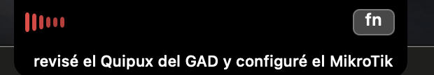

# 🎙 BetoDicta

Dictado por voz para macOS que **abraza el notch**: pulsa una tecla, habla, y el texto aparece EN VIVO junto al notch de tu Mac mientras las barras laten con tu voz. Pulsa de nuevo y el texto se pega donde estaba tu cursor.

## 🌐 Página oficial

**[betodicta.eztic.ec](https://betodicta.eztic.ec/)** — todo sobre la app, motores y guía de instalación.

## 📖 Manual de usuario

**[Manual completo](docs/MANUAL.md)** — instalación, cada pestaña, cada motor, cada ajuste, con capturas.

## ⬇️ Descarga

**[Descargar BetoDicta (DMG) — última versión](https://github.com/btoaldas/BetoDicta/releases/latest)**

Arrastra a Aplicaciones. Requiere macOS 14+ y Apple Silicon.

### O con Homebrew

```bash
brew install --cask btoaldas/tap/betodicta
# firma propia: para saltar el aviso de Gatekeeper
brew install --cask --no-quarantine btoaldas/tap/betodicta
```

Instala siempre el **último release**. La app también se actualiza sola desde dentro: las copias 0.40–0.42 aceptan 0.43 porque conserva su misma identidad de firma; desde 0.43, además, el DMG completo se autentica con Ed25519.

**Primera apertura** (macOS dirá "Apple no pudo verificar…" porque la app es open source y no viene de la App Store): pulsa "Listo" → **Ajustes del Sistema → Privacidad y seguridad** → baja hasta "Seguridad" → **"Abrir de todos modos"**. Es una sola vez.



Hecho en Ecuador 🇪🇨 para el español latino — nació porque los dictados comerciales no entendían palabras como *Quipux*, *DGTIC* o *SENESCYT*.

## Características

- **Modos — entiende la intención y decide qué hacer**: además de **Dictado**, usa **Correo, Oficio, Tarea, Nota, Traducir, Resumir, Asistente, Agente, Buscar, Música** o **Aplicación**, cada uno con comportamiento/color propios. El modo Aplicación hace un inventario de las apps reales del Mac: *"modo abrir aplicación Word, borrador del informe"* abre Word y coloca el texto (sin enviarlo). Entiende comandos explícitos y pedidos naturales, incluso cadenas de **1 a N etapas** (*"resume, traduce al quichua y envía por correo y WhatsApp"*) con idioma y destinatario. Ante una propuesta, el notch se expande: **fn una vez confirma; X continúa el dictado normal**. Reglas locales → embeddings con margen → IA opcional como último árbitro, siempre con degradación suave y sin ejecutar acciones ambiguas. También admite pausa en vivo, app/sitio, un solo uso y modos propios.
- **Asistente por voz parametrizable**: nombre, personalidad y disparadores libres de mínimo dos palabras. En macOS 26 ofrece **activación manos libres local y opt-in**. El comportamiento recomendado es estable y funciona como un timbre: dices solamente la frase configurada, una pausa acústica configurable confirma que terminaste, BetoDicta responde con una alternativa breve editable (*“Te escucho”*, *“Dímelo”*, *“Cuéntame”*…) y abre un turno Agente limpio. El **dictado asistido sin manos** entiende *“dicta/transcribe/escribe/corrige/mejora esto…”*: pule, pega en el campo original y conserva opcionalmente el portapapeles; *“dictado”* solo abre un segundo turno automático. Cada salida se configura por separado y degrada al texto original sin IA. Si el parcial crece con contenido, el candidato se cancela; frase + orden en una sola toma sigue disponible como opción avanzada, apagada por defecto. El listener se pausa al grabar, procesar o hablar y se rearma al volver a reposo. Una **pasarela Siri/Atajos firmada e instalable** adopta el nombre actual del agente; cuando manos libres ocupa el micrófono, una compatibilidad local opt-in reconoce solo *“Oye Siri + nombre”* sin robar órdenes genéricas a Siri. Antes de despertar no registra ni sube ambiente; fn sigue disponible y versiones anteriores degradan sin bloquear. Como toda app de terceros que usa el micrófono, macOS mantiene visible su indicador de privacidad. Incluye memoria corta local con seguimientos (*“mándaselo a Alberto”*), IA propia, Hermes o **cuenta ChatGPT mediante Codex oficial**, con modelo/razonamiento elegibles, failover y tres niveles de autonomía. La cuenta Codex también puede elegirse para **pulido, traducción y la IA de cada Modo**, pero está identificada como IA de texto y **no entra en la cascada STT**. Entiende órdenes estructuradas como *“abre Gmail y escribe un correo para a@b.com…”* o *“abre Word y crea un oficio…”*: enruta localmente, usa IA solo para redactar, abre **borradores que nunca envía solo** y permite crear un archivo mediante selector nativo. También consulta el **clima y pronóstico reales** y controla **porcentaje, subida/bajada, máximo y silencio del volumen del Mac**, todo localmente y con verificación del estado final. Puede responder en texto o texto+voz y nunca anuncia éxito antes de la evidencia. Recordatorios/Calendario usan EventKit; **Nota de Apple crea, da formato y vuelve a leer una nota real mediante la automatización oficial de Notes**; archivos usan Spotlight. La cuenta ChatGPT y el API OpenAI siguen separados; BetoDicta delega la autorización a Codex y nunca lee sus credenciales.
- **Recetas de automatización y Atajos portables**: incluye Resumen del día, empezar/cerrar jornada, reunión, actuar o leer la selección, estado del Mac, captura inteligente, conversión de audio seleccionado y escenas HomeKit autorizadas. Las recetas encadenan pasos con evidencia y se importan/exportan como paquetes JSON **Trabajo, Universidad, Casa o Personal**. El wizard pregunta el nombre del asistente y ofrece tres instaladores firmados, recuperables luego desde Ajustes: **Escuchar asistente, BetoDicta Universal y Reproducir música**. macOS siempre pide consentimiento para añadirlos. El puente universal acepta acciones estructuradas para música, calendario, recordatorios, apps, foco, HomeKit y capturas sin exportar claves ni obligar a mantener decenas de Atajos aislados.
- **Tareas y notas con recordatorios locales**: detecta fechas dictadas, muestra un tablero y calendario, avisa una sola vez mediante notificación de macOS + notch y, si quieres, la voz TTS elegida. Al despertar o volver a la app recupera lo vencido. Los resúmenes de mañana/tarde son configurables; permanecen 100 % locales o pueden recibir redacción opcional de la IA elegida, con fallback local en seis segundos.
- **Captura y grabación de pantalla por voz**: pantalla completa/principal, ventana, selección o cuadrante; Escritorio/Descargas/Documentos/selector; nombre, portapapeles, abrir, duración, micrófono y clics configurables. Entiende también formas naturales como *“grabemos la pantalla”* o *“hagamos una grabación”* sin convertir una grabación de audio en captura; si falta el área, pregunta **pantalla o ventana** y conserva el pedido. Sin duración, BetoDicta graba de inmediato y una sola pulsación de la tecla de dictado —o **Detener y guardar** en su menú— cierra el `.mov` exactamente en la carpeta pedida. Al terminar deja una confirmación persistente con la ruta y **Ver en Finder**. Fragmentos periódicos configurables protegen las tomas largas y se recuperan al reabrir tras una caída; el notch permanece oculto. Para WhatsApp eliges **solo portapapeles**, **pegar sin enviar** (recomendado) o **autoenviar** de forma explícita; incluso entonces solo envía si Accesibilidad confirma que apareció una vista previa nueva del adjunto.
- **Modo Música con failover y reproductor interno**: Apple Music, Spotify, **BetoDicta · YouTube**, YouTube Music, YouTube, SoundCloud, Bandcamp o un buscador propio con `{q}`; la cascada se ordena y salta lo no disponible. **“Pon/reproduce”** intenta hacer sonar una coincidencia; **“busca”** abre resultados sin reproducir. El reproductor propio tiene cola, favoritos locales, listas de la cuenta OAuth, búsqueda musical o de tutoriales, vista compacta/pantalla completa y controles por interfaz, menú o voz: pausa, reanuda, anterior, siguiente, stop y cerrar. Usa YouTube Data API + IFrame Player oficiales, con API key propia u OAuth de escritorio autorizado en el navegador, nunca contraseña embebida ni extracción de audio. *“Pon música”* espera a que Apple Music termine de arrancar y elige por defecto una canción aleatoria (filtra audios técnicos cortos), aunque puedes configurarlo para reanudar lo último. Para un artista/título que no está local, consulta el catálogo público oficial de Apple, selecciona el primer resultado **visible** mediante Accesibilidad y verifica la fila/trackId real antes de afirmar éxito. En Spotify, una orden explícita de reproducir abre la consulta, activa el primer resultado visible y comprueba el estado real del reproductor; una orden de buscar nunca pulsa Play. **YouTube Music** detecta por nombre su app o PWA instalada (sin depender de Brave/Chrome/Edge), usa su buscador propio y verifica el botón **Pausar** y la pista de esa ventana; si no hay app, repite el flujo en la web HTTPS. El Atajo firmado **“BetoDicta · Reproducir música”** sigue incluido como puente opcional. Si un motor no confirma audio, salta al siguiente sin inventar éxito.
- **Texto en vivo 100% LOCAL**: Voxtral Realtime 4B o Nemotron 3.5 Streaming (motor [transcribe.cpp](https://github.com/handy-computer/transcribe.cpp)) — ves lo que dices mientras lo dices, sin internet. En 0.47.1 se verificaron con modelos reales `transcribe.cpp` 5a5a496 y `llama.cpp` b10068; Voxtral Mini vuelve a transcribir correctamente al recibir primero la instrucción y luego el audio. Las revisiones exactas y su QA quedan en [`docs/DEPENDENCIES.md`](docs/DEPENDENCIES.md)
- **Preview universal en el notch**: en macOS 26, el dictado nativo de Apple puede mostrar **en vivo y de forma local** lo que vas diciendo aunque el motor real (por ejemplo Groq) trabaje por lotes. Es solo una vista previa: al soltar `fn`, tu cascada elegida hace la transcripción definitiva
- **Texto en vivo en la nube**: streaming por WebSocket con ElevenLabs Scribe v2 Realtime y (opt-in) **Deepgram, Soniox, AssemblyAI, Speechmatics, Gladia** — marcados con etiqueta **"EN VIVO"** en la lista de motores
- **Muchos motores de transcripción, varios GRATIS y otros premium**: nube compatible-OpenAI (ElevenLabs, Groq Whisper gratis, OpenAI, Mistral Voxtral, Fireworks) · API propia (Hugging Face gratis, Deepgram, AssemblyAI, Gladia, Speechmatics, Cloudflare, **Soniox**, **Azure con es-EC de Ecuador**) · locales con detección inteligente (Ollama/LM Studio solo si tienen whisper). Precios por hora **se actualizan solos** desde LiteLLM
- **Failover multi-motor**: cascada arrastrable; si uno falla, salta al siguiente solo. Un gateway propio también puede transcribir (no solo pulir)
- **Modelos locales descargables desde la app**: Whisper (tiny→large-v3), Voxtral Mini 3B y Realtime 4B, Nemotron 3.5, Canary 1B Flash
- **Tu propia voz, local, segura y portable**: una persona puede conservar hasta cuatro carriles sin perder ninguno: **✨ Máxima (XTTS + Resemble Enhance)**, **Calidad (XTTS residente)**, **⚖️ Equilibrada (Qwen3‑TTS sobre MLX, streaming local en Apple Silicon)** y **⚡ Rápida (Piper/ONNX)**. Máxima replica dentro de BetoDicta la receta de mayor identidad (parámetros XTTS, restauración y normalización), sin llamar a Hermes ni a una carpeta de Descargas. Entrenar también usa scripts y bases verificadas gestionadas por la app. Solo el motor activo queda caliente: 60 min al abrir, 15 min tras usarlo y una frase silenciosa opcional, todo editable. Los textos largos XTTS se segmentan localmente y un stream truncado ya no se acepta como completo. El paquete portable lleva modelo, referencias, persona y recetas; los runtimes comunes se instalan una vez. Quitar una voz la mueve a una papelera recuperable y cambiar/quitar componentes siempre pide confirmación
- **Panel abraza-notch**: latido de voz a la izquierda del notch, tecla a la derecha, teleprompter de una línea debajo — negro puro, como si fuera parte del hardware
- **Tecla `fn`** (o F1–F12, configurable) — toque limpio para empezar/terminar, las combinaciones fn+otra-tecla no lo disparan; opcionalmente exige **doble pulsación para iniciar** y una para detener
- **Keyterms**: tu vocabulario personal viaja al modelo — nombres propios y términos técnicos salen bien a la primera
- **Reemplazos**: correcciones automáticas post-transcripción (palabra completa, sin distinguir mayúsculas)
- **Pulido con cualquier IA + elige el modelo**: pule/traduce con Groq, OpenAI, Mistral, OpenRouter, DeepSeek, xAI, **Anthropic (Claude)**, **Gemini (Google)**, **Moonshot/Kimi K2.6** o **Kimi K3/K2.7 con la cuota de tu cuenta Kimi Code**, además de tu gateway propio — o **local** (LM Studio/Ollama, sin que nada salga de tu Mac). Eliges el **modelo** de cada proveedor al vuelo y, si publica precios, ves el costo. Las claves de Kimi API y Kimi Code se mantienen separadas para no mezclar cobros/cuotas. Aviso de privacidad al usar nube/terceros
- **Push-to-talk opcional**: graba mientras mantienes la tecla y termina al soltarla (o el modo toque de siempre)
- **Caja negra**: cada dictado guarda audio y texto en `historial/año/mes/día/` — el audio se escribe a disco EN VIVO chunk a chunk; un crash no te roba ni un segundo
- **Pausa real de multimedia**: al dictar pausa lo que suene (Edge, Chrome, Music, Spotify, YouTube…) y lo reanuda al terminar, además de bajar el volumen; usa el estado real de reproducción, sin bug de toggle
- **Guardián del silencio**: si te olvidas la tecla abierta, se cierra solo tras N segundos sin voz (no le regalas plata a la nube)
- **Odómetro + gasto de pulido**: minutos dictados por día/semana/mes/año y costo estimado, más KPIs de gasto de pulido con IA (tokens→costo) con gráfica, en Estadísticas
- **Búsqueda por significado en el historial** (semántica, opt-in): encuentra dictados por IDEA, no por palabra exacta, con embeddings — motor a elegir (Ollama local gratis, OpenAI, Gemini, Mistral)
- **Salvaguarda anti-inyección** (opt-in): si un gateway de terceros devuelve texto anómalo (comandos shell que no dictaste), pega tu dictado original
- **Ayuda por proveedor**: cada IA de nube (chat y voz) trae un icono de ayuda con explicación instantánea y un enlace **"Conseguir clave"** que abre la página oficial de su API key
- **Copiar último dictado**: rescate en un clic desde el menú
- **Actualizador estable/beta**: canal automático, solo estable o estable+beta; consulta al abrir y periódicamente (1–24 h), permite comprobar a mano y usa failover cuando GitHub excluye las prereleases de `latest`

## Requisitos

- macOS 14+ (Apple Silicon)
- **Nada más para empezar**: los motores **locales** (Whisper, Voxtral, Nemotron, Canary) corren 100% offline, gratis y **sin ninguna API key**
- *(Opcional)* la API key de un servicio de **nube** si quieres máxima calidad o texto en vivo — varios con capa **GRATIS** (Groq Whisper 2000/día, Hugging Face…). El asistente te lo pone fácil y cada proveedor tiene un botón "Conseguir clave"
- *(Solo para compilar desde el código)* Xcode 26+

## Instalación

```bash
git clone https://github.com/btoaldas/BetoDicta.git
cd BetoDicta
make install       # compila y copia a /Applications
open -a BetoDicta
```

Tu API key, por cualquiera de estas vías:

```bash
mkdir -p ~/.betodicta
echo 'ELEVENLABS_API_KEY=tu_key_aqui' > ~/.betodicta/.env
```

o exporta la variable de entorno `ELEVENLABS_API_KEY`.

### Permisos de macOS

BetoDicta necesita **Micrófono**, **Monitorización de entrada** (para la tecla `fn`) y **Accesibilidad** (para pegar el texto). **Grabación de pantalla** solo se solicita si activas capturas/grabaciones desde el Asistente. **Ubicación** es opcional y solo se pide cuando consultas el clima sin decir una ciudad; una ciudad explícita no usa GPS. macOS pide cada permiso al primer uso correspondiente.

### Firma de código (opcional pero recomendado)

macOS identifica cada app por su firma. Con firma **ad-hoc** (por defecto), cada `make install` genera una firma distinta y macOS te vuelve a pedir los permisos. Para que **los permisos se conserven entre recompilaciones**, crea tu propio certificado — una sola vez:

```bash
./scripts/crear-certificado.sh
```

Genera un certificado personal `BetoDicta Self Signed` en **tu** llavero. El `make install` lo detecta y firma con él automáticamente (si no existe, cae a ad-hoc sin fallar).

**¿Por qué no viene un certificado en el repo?** Porque un certificado de firma es una **identidad personal**, como tu firma o la llave de tu casa: compartir su clave privada dejaría que cualquiera suplante tu app. Por eso cada quien crea el suyo y la clave privada nunca sale de tu Mac. No es un secreto tan crítico como una API key, pero la buena práctica es que sea tuyo e intransferible.

## Configuración

Todo vive en `~/.betodicta/` (editable desde el menú 🎙):

| Archivo | Qué es |
|---|---|
| `config.json` | tecla, modelo, silencio_max_seg, sonidos, esc_cancela, atenuar_multimedia, silenciar_ademas, post_proceso, prompt_pulido, panel_visible, modo_desarrollo… |
| `keyterms.txt` | Tu vocabulario, una palabra por línea (streaming usa las primeras 50) |
| `reemplazos.json` | `[{"original": "variante1, variante2", "replacement": "Palabra"}]` |
| `historial/` | Tus dictados: `.wav` + `.txt` por año/mes/día |
| `uso.jsonl` | El odómetro |
| `agente_memoria.json` | Memoria conversacional corta y local del asistente |
| `agente_rutinas.json` | Recetas incluidas, personalizaciones y rutinas del usuario |
| `atajos_apple.json` | Atajos descubiertos, habilitación individual y nivel de riesgo |
| `logs/agente.jsonl` | Decisiones y resultados auditables del asistente |

Modelos: `scribe_v2_realtime` (texto en vivo) · `scribe_v2` · `scribe_v1` (por lotes, más barato).

## Entorno de desarrollo

- **macOS 14+** en Apple Silicon · **Xcode 26+** (Swift 6) · sin dependencias externas: Swift puro + AppKit/AVFoundation
- `make install` compila (Swift Package Manager) y arma el bundle firmado con certificado propio en /Applications
- **QA reproducible**: `scripts/qa-paquete.sh --automatico` ejecuta pruebas locales seguras sin abrir apps ni enviar nada. Las matrices, 30 casos manuales de camino feliz, 50 casos de estrés y la hoja de resultados están en [`qa/0.47.0/`](qa/0.47.0/README.md). `--audio` y `--ia` son pruebas opcionales que pueden consumir los proveedores configurados.
- Código modular en `Sources/BetoDicta/` (Config, Recorder, HistoryWriter, MediaControl, clientes Scribe, panel, AppDelegate…)
- Los usuarios normales NO tocan archivos: el asistente de configuración (y Ajustes → Modelos) guarda las claves y ajustes solos en `~/.betodicta/`. Los `*.example` (`.env.example`, `config.example.json`, `keyterms.example.txt`, `reemplazos.example.json`) son solo **referencia del formato** para desarrolladores o para pre-cargar valores a mano — opcionales
- Este entorno se actualiza con el proyecto: si algo no compila en una versión nueva de Xcode, abre un issue

## Privacidad y seguridad de datos

- **Tu voz solo viaja al motor que TÚ elijas** (cifrada: HTTPS/WSS) — o a **ningún lado** si usas un motor local (Whisper/Voxtral/Nemotron/Canary, 100% offline). No hay analítica, ni telemetría, ni terceros ocultos
- **Tu API key jamás se escribe en logs** ni en el código — vive en tu `~/.betodicta/.env` (bloqueado por `.gitignore`)
- **Tus dictados nunca salen de tu Mac**: `historial/` y `uso.jsonl` son archivos locales tuyos; la carpeta `~/.betodicta` queda en `700` y los archivos con secretos (`.env`, gateways) en `600`
- **Actualizaciones verificadas por firma**: desde 0.43, cada DMG lleva una firma **Ed25519 separada** y BetoDicta contiene solo la clave pública para comprobarla; además exige el mismo bundle id y certificado de la app. Un DMG alterado, una firma ausente o una app distinta se rechazan. Las claves privadas de release nunca salen del Mac del autor
- **Gateways propios**: la API key no se envía si el gateway usa `http://` sin cifrar
- El portapapeles se restaura tras cada pegado — lo que tenías copiado no se pierde
- Cada release pasa por **revisión de código y de seguridad** antes de publicarse

## Hoja de ruta

Lo que sigue (pendiente e ideas — ¿te falta algo? [abre un issue](https://github.com/btoaldas/BetoDicta/issues/new)):

- [ ] **Google Cloud Speech (Chirp)** — español LATAM tope de gama (requiere autenticación con cuenta de servicio GCP)
- [ ] **Azure AI Speech EN VIVO** — hoy va por lotes; su tiempo real es por SDK
- [ ] Afinar el streaming en vivo de cada motor de nube (Deepgram, AssemblyAI, Gladia…) con pruebas reales de punta a punta
- [ ] **Traducción en vivo** mientras dictas
- [ ] Más idiomas y mejor multilingüe según lo que pidan
- [ ] Dictado por comandos de voz (puntuación y formato hablados)

## Créditos

Creado por **Alberto Aldás** ([@btoaldas](https://github.com/btoaldas)) en compañía de **Claude** (Anthropic) — programado a pura voz, dictándole a las mismas herramientas que lo inspiraron. Inspirado en el gran corazón open source de [Handy](https://github.com/cjpais/Handy) de **@cjpais**.

**Motores y librerías de código abierto:**
- [whisper.cpp](https://github.com/ggml-org/whisper.cpp) y [llama.cpp](https://github.com/ggml-org/llama.cpp) (ggml-org) — Whisper y Voxtral locales
- [transcribe.cpp](https://github.com/handy-computer/transcribe.cpp) — streaming local en vivo (Voxtral Realtime / Nemotron)
- [mediaremote-adapter](https://github.com/ungive/mediaremote-adapter) de Jonas van den Berg (BSD-3-Clause) — pausa de multimedia
- [Ollama](https://ollama.com) y [LM Studio](https://lmstudio.ai) — IA local (chat, embeddings, whisper)

**Datos y fuentes:** [LiteLLM](https://github.com/BerriAI/litellm) (precios de modelos que se actualizan solos) · [Open-Meteo](https://open-meteo.com/) y [GeoNames](https://www.geonames.org/) (geocodificación y pronóstico meteorológico) · modelos ASR: Whisper de OpenAI ([ggml de ggerganov](https://huggingface.co/ggerganov/whisper.cpp)), Voxtral de Mistral ([GGUF de ggml-org](https://huggingface.co/ggml-org/Voxtral-Mini-3B-2507-GGUF)), Nemotron y Canary de NVIDIA ([GGUF de handy-computer](https://huggingface.co/handy-computer)) · [bge-m3](https://huggingface.co/BAAI/bge-m3) (BAAI, búsqueda semántica).

**Servicios de IA que puedes conectar** (opcionales, muchos con capa gratis) — transcripción: ElevenLabs, Groq, OpenAI, Mistral, Fireworks, Hugging Face, Deepgram, AssemblyAI, Gladia, Speechmatics, Cloudflare, Soniox, Azure · pulido/traducción: OpenRouter, Anthropic, Google Gemini, DeepSeek, xAI, **Moonshot AI/Kimi**, **Kimi Code por cuenta**, Cerebras, GitHub Models, NVIDIA, Together, Novita, Z.ai, SiliconFlow. Cada uno con su enlace y botón "Conseguir clave" dentro de la app (Créditos y Modelos).

## Licencia

[GPL-3.0](LICENSE) — libre para siempre: cualquiera puede usarlo, estudiarlo y mejorarlo, pero nadie puede convertirlo en un producto cerrado. Las mejoras se quedan en la comunidad.
