# 🎙 BetoDicta — Manual de usuario

**Dictado por voz para macOS en español latino — con motores en la nube y 100% locales, failover automático, texto en vivo junto al notch, y una app que aprende tu vocabulario.**

> Página oficial: [betodicta.eztic.ec](https://betodicta.eztic.ec/) · Descargas: [GitHub Releases](https://github.com/btoaldas/BetoDicta/releases/latest) · ¿Problemas? [Reporta un issue](https://github.com/btoaldas/BetoDicta/issues/new)

---

## Índice

1. [Qué es BetoDicta](#1-qué-es-betodicta)
2. [Requisitos](#2-requisitos)
3. [Instalación](#3-instalación)
4. [Tu primer dictado](#4-tu-primer-dictado)
5. [El panel del notch](#5-el-panel-del-notch)
6. [El menú de la barra (y el Dock)](#6-el-menú-de-la-barra-y-el-dock)
7. [La cascada de failover](#7-la-cascada-de-failover)
8. [Los motores, uno por uno](#8-los-motores-uno-por-uno)
9. [Pestaña Modelos (y el precio por modelo)](#9-pestaña-modelos-y-el-precio-por-modelo)
10. [Cambiar de motor al vuelo](#10-cambiar-de-motor-al-vuelo)
11. [Pestaña Ajustes](#11-pestaña-ajustes)
11 bis. [Pestaña Asistente](#11-bis-pestaña-asistente)
12. [Pestaña Acciones](#12-pestaña-acciones)
13. [Glosario y reemplazos](#13-glosario-y-reemplazos)
14. [Que la app aprenda de ti (aprendizaje)](#14-que-la-app-aprenda-de-ti-aprendizaje)
15. [Corrección por sonido (fonética)](#15-corrección-por-sonido-fonética)
16. [Traducir al dictar](#16-traducir-al-dictar)
17. [Pestaña Historial](#17-pestaña-historial)
18. [Pestaña Transcribir](#18-pestaña-transcribir)
19. [Estadísticas y costo por modelo](#19-estadísticas-y-costo-por-modelo)
20. [Actualizar la app](#20-actualizar-la-app)
21. [Apoya el proyecto](#21-apoya-el-proyecto)
22. [La caja negra: tus datos](#22-la-caja-negra-tus-datos)
23. [Solución de problemas](#23-solución-de-problemas)
24. [Preguntas frecuentes](#24-preguntas-frecuentes)
25. [Voz propia: biblioteca y entrenamiento](#25-voz-propia-biblioteca-y-entrenamiento)

---

## 1. Qué es BetoDicta

BetoDicta convierte tu voz en texto en cualquier aplicación del Mac: pulsas una tecla, hablas, vuelves a pulsar, y el texto aparece donde estaba tu cursor. Fue creada en Ecuador 🇪🇨 para el español latino, porque los dictados comerciales no entendían palabras como *Quipux*, *DGTIC* o *SENESCYT*.

Sus cuatro superpoderes:

- **Texto en vivo**: ves lo que dices mientras lo dices, junto al notch — con la nube (ElevenLabs) o **100% sin internet** (Voxtral Realtime, Nemotron).
- **Failover transparente**: si un motor falla, otro toma el mando solo — nunca pierdes un dictado.
- **Tu vocabulario manda**: tu glosario personal llega a todos los motores, y una capa de reemplazos corrige después.
- **Aprende de ti**: cuando corriges una palabra ahí donde la pegaste, la app aprende la regla sola (Kipux → Quipux) — sin que vuelvas a repetir el trabajo.

## 2. Requisitos

- **macOS 14 o superior**
- **Apple Silicon** (chip M1 en adelante)
- Micrófono (el del Mac sirve perfecto)
- Internet **solo** para: descargar modelos, usar motores de nube y actualizar la app. Dictar con motores locales funciona sin conexión.

## 3. Instalación

Hay dos formas. Cualquiera te deja la app lista; los permisos y ajustes se configuran igual (el [asistente](#31-el-asistente-de-primer-arranque) te guía).

**Opción A — Homebrew** (lo más rápido):
```bash
brew install --cask btoaldas/tap/betodicta
# o, para saltar el aviso de Gatekeeper (firma propia):
brew install --cask --no-quarantine btoaldas/tap/betodicta
```
> **¿Ya tenías BetoDicta instalada a mano?** Si brew se queja con `Error: It seems there is already an App at '/Applications/BetoDicta.app'`, adóptala con `--force` (una sola vez):
> ```bash
> brew install --cask --force btoaldas/tap/betodicta
> ```
> **Gobernanza — siempre la última**: el tap usa `version :latest`, así que `brew install` **siempre baja el último release**. Como `:latest` no "sube" solo, para traer la más nueva por brew usa `brew upgrade --cask --greedy` (o `brew reinstall --cask btoaldas/tap/betodicta`). De todos modos, la app **se actualiza sola desde dentro** (ver §20): te avisa al abrir y, si activas *Autoactualizar*, se instala sola.

**Opción B — Manual (DMG):**

1. Descarga el DMG desde [GitHub Releases](https://github.com/btoaldas/BetoDicta/releases/latest).
2. Abre el DMG y **arrastra BetoDicta.app a la carpeta Aplicaciones**.
3. **Primera apertura** — macOS mostrará *"Apple no pudo verificar que BetoDicta no contenga software malicioso"*. Es normal: la app es open source y no viene de la App Store. Haz esto:
   - Pulsa **"Listo"** (¡no "Mover al basurero"!)
   - Ve a **Ajustes del Sistema → Privacidad y seguridad**, baja hasta la sección **Seguridad**
   - Pulsa **"Abrir de todos modos"** y pon tu contraseña. Es una sola vez.
4. **Permisos** — la app pedirá:
   - **Micrófono**: para escucharte (obvio).
   - **Accesibilidad**: para pegar el texto donde está tu cursor, detectar la tecla de dictado y (si lo activas) aprender de tus correcciones. Ve a Ajustes del Sistema → Privacidad y seguridad → Accesibilidad y activa BetoDicta.
5. Verás el **micrófono en la barra de menú** (arriba a la derecha). Listo.

### 3.1 El asistente de primer arranque

La primera vez que abres BetoDicta aparece un **asistente** que te lleva de la mano por todo en ~1 minuto. Si prefieres verlo otra vez más tarde: Configuración → Créditos → **"Volver a ver el asistente de configuración"**.

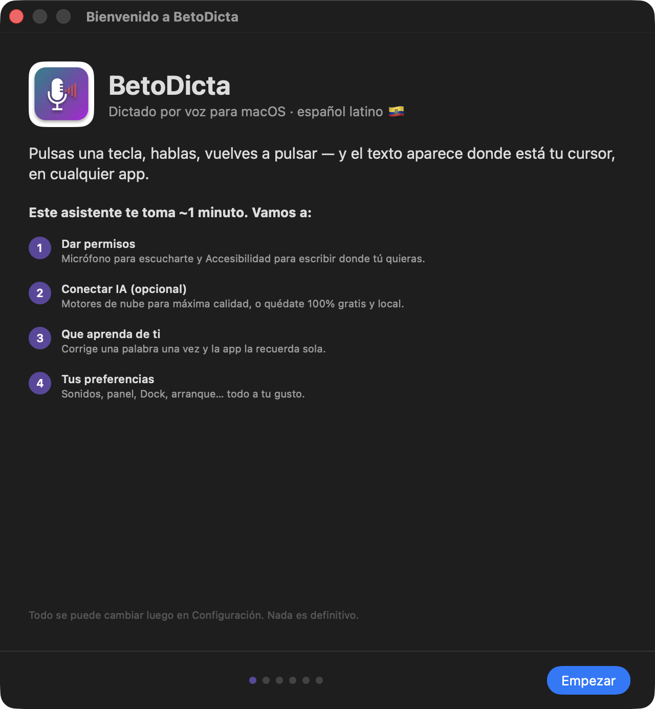

Son 8 pasos:

0. **Bienvenida** — qué hace la app y qué vas a configurar.
1. **Permisos** — micrófono y accesibilidad, con **check en vivo**: apenas concedes cada uno, su fila se pone en **verde "Activado"**.

   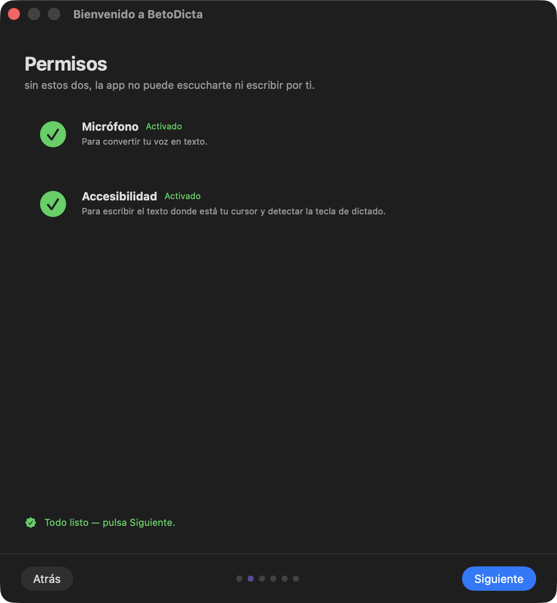

   > La accesibilidad **pide reiniciar** la app para tomar efecto. No te preocupes: el asistente vuelve **exactamente a este paso** y verás los dos permisos en verde ("check activado, check activado"). El botón **"Reiniciar BetoDicta ahora"** lo hace por ti. Solo cuando pulses **Finalizar** al final, el asistente se da por terminado — un reinicio a mitad NO te lo salta.
2. **IA en la nube (opcional)** — conecta un servicio pegando su clave, o déjalo en blanco para quedarte 100% gratis y local. Arriba, un recuadro verde resalta las opciones **GRATIS** para máquinas sin fuerza o sin presupuesto: **Groq Whisper** (2000 transcripciones/día) y **Hugging Face** para voz, y modelos **`:free`** de OpenRouter para pulido — **sin tarjeta**. Por seguridad, si ya tienes una clave guardada **no se muestra**: solo pega una nueva si la quieres cambiar.

   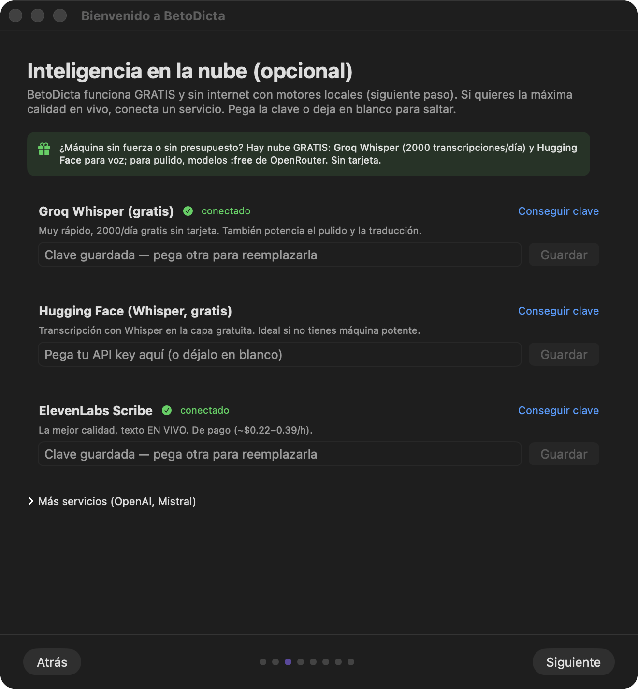
3. **IA local** — descarga los motores que corren gratis y **sin internet** (Voxtral Realtime, Nemotron, Canary, Whisper, Voxtral Mini). La descarga sigue en **segundo plano** aunque avances o cierres; pulsa **"Usar"** para dejarlo en tu cascada.

   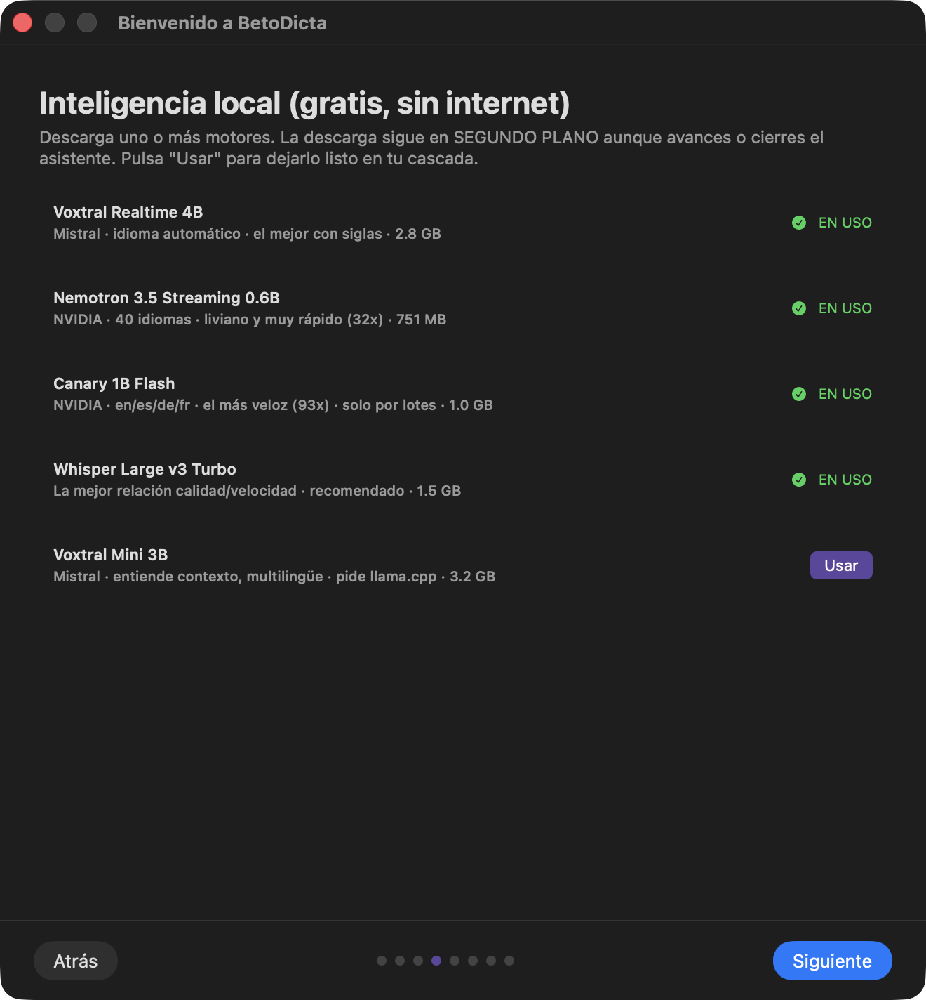
4. **Orden del failover** — cuál motor va #1, cuál de respaldo. Enciende los que quieras (uno basta) y ordénalos con las flechas. En una instalación nueva te **sugiere una IA local de #1** (funciona sin internet) y ElevenLabs de #2; el botón **"Aplicar sugerencia"** lo hace de un clic.

   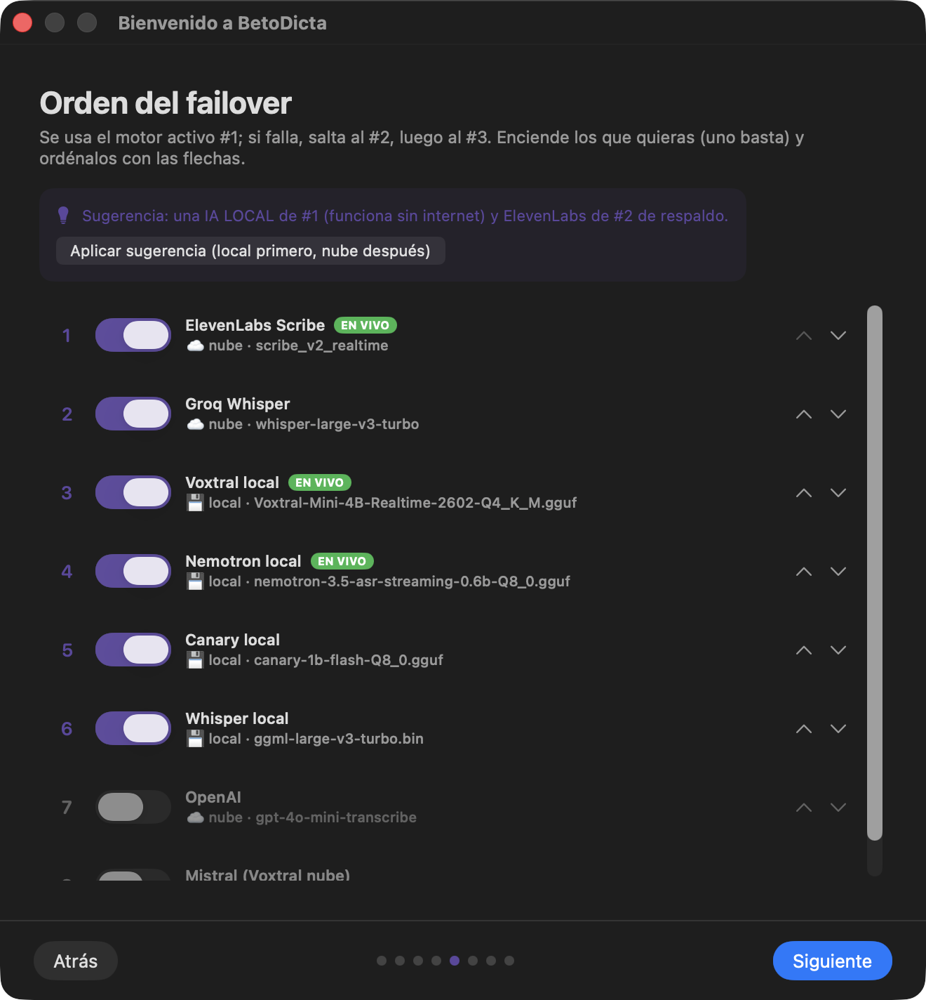
5. **Aprendizaje y glosario** — enciende que aprenda de tus correcciones, la corrección por sonido y el pulido con IA; y agrega las primeras palabras de tu glosario (nombres, siglas, términos).
6. **Preferencias** — tecla de dictado, micrófono, sonidos, panel, Esc, multimedia, volumen, Dock, arranque al iniciar sesión y modo desarrollo. Cada opción con su nota de qué hace y para qué.

   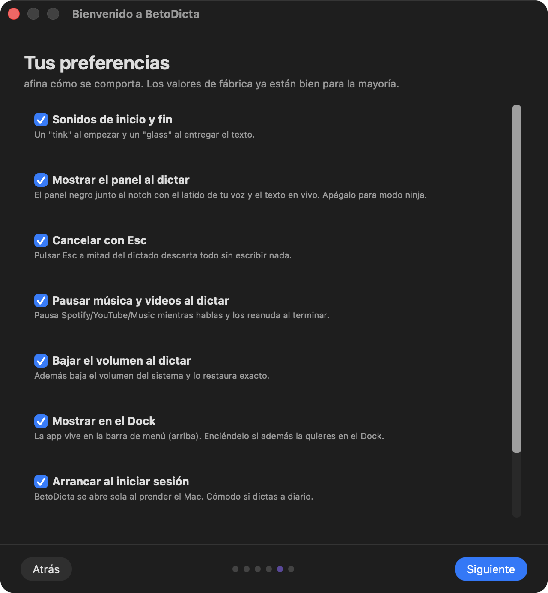
7. **¡Listo!** — a dictar (y, si te sirve, un cafecito para apoyar el proyecto).

Todo lo que elijas aquí se puede cambiar después en Configuración. Los valores de fábrica ya vienen bien para la mayoría.

## 4. Tu primer dictado

1. Pon el cursor donde quieras escribir (un correo, Word, WhatsApp Web, donde sea).
2. **Pulsa y suelta la tecla `fn`** (la de abajo a la izquierda del teclado).
3. Habla normal. Verás el panel negro junto al notch con barras que laten con tu voz.
4. **Pulsa `fn` otra vez**. El texto se escribe donde estaba tu cursor.

Trucos:
- **Esc cancela** el dictado sin escribir nada.
- Si te olvidas la tecla abierta, el **guardián del silencio** cierra el dictado solo tras un rato sin voz (configurable).
- La tecla se puede cambiar (F1–F12 o combinaciones como ⌘⇧D) en Ajustes.

## 5. El panel del notch


- **Izquierda**: barras que laten con tu voz — si no laten, el micrófono no te escucha.
- **Derecha**: la tecla de dictado y, encima, **el letrero del motor** que está trabajando en ese momento:
  - **Verde** = texto en vivo (ves lo que dices mientras hablas)
  - **Gris** = el texto llega al soltar la tecla
  - El letrero **rota solo** si el failover cambia de motor a mitad del dictado.
- **Abajo**: el teleprompter — una línea con lo último que dijiste.
- **Clic sobre el letrero del motor** abre el selector rápido de proveedor (ver [sección 10](#10-cambiar-de-motor-al-vuelo)).

> **Ver en vivo lo que dices (💬).** Aunque tu motor no tenga streaming (Groq, Whisper local…), el notch te muestra **lo que vas diciendo mientras hablas**, usando el transcriptor nativo de Apple (macOS 26, local y gratis). Es **solo visual**: al soltar la tecla, la transcripción real la hace tu cascada de modelos como siempre — el preview jamás se pega. Se activa/desactiva en `Ajustes → Ver en vivo lo que dices (notch)`. Si un motor con texto en vivo real está trabajando (ElevenLabs realtime, Whisper local en vivo), ese manda y el preview se aparta solo.

## 6. El menú de la barra (y el Dock)

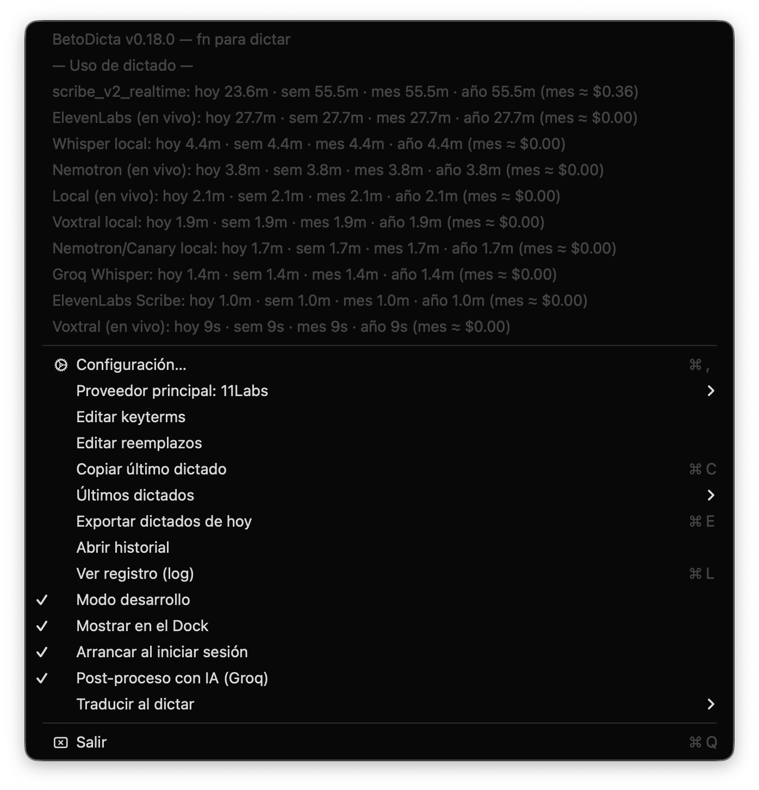

**Clic en el micrófono de la barra de menú** (arriba a la derecha) — es tu centro de accesos directos:

| Opción | Qué hace |
|---|---|
| **BetoDicta vX — fn para dictar** | Recordatorio de tu tecla y versión |
| **Configuración…** (⌘,) | Abre la ventana principal |
| **Proveedor principal ▸** | Cambia el motor #1 con un clic (solo lista los activos, ✓ en el actual) |
| **Editar keyterms** | Abre tu glosario en el editor de texto |
| **Editar reemplazos** | Abre tus reglas de corrección |
| **Copiar último dictado** (⌘C) | El texto del dictado más reciente al portapapeles |
| **Últimos dictados ▸** | Los 5 más recientes — clic en uno y se copia |
| **Exportar dictados de hoy** (⌘E) | Genera un Markdown con todos los dictados del día |
| **Abrir historial** | La carpeta con todos tus audios y textos |
| **Ver registro (log)** (⌘L) | El registro técnico de la app |
| **Modo desarrollo** | Detalle técnico extra en el log |
| **Mostrar en el Dock** | La app también en el Dock |
| **Arrancar al iniciar sesión** | Autoarranque con el Mac |
| **Post-proceso con IA (Groq)** | Interruptor rápido del pulido |
| **Traducir al dictar ▸** | Elige idioma o desactiva |
| **— Uso de dictado —** | Muestra solo los **3 motores más usados** para que el menú siga compacto. **Ver todos los consumos…** abre un panel de altura fija con desplazamiento y acceso a Estadísticas |
| **Salir** (⌘Q) | Cierra BetoDicta |

**En el Dock** (si activaste "Mostrar en el Dock"):
- **Clic izquierdo** en el ícono → abre la Configuración
- **Clic derecho** → el mismo menú completo de la barra

## 7. La cascada de failover

La cascada es la lista ordenada de motores en **Configuración → Modelos**. Reglas:

- **El #1 manda**: cada dictado empieza con él.
- **Si falla, salta al #2, luego al #3…** — automático y transparente: tú sigues hablando.
- **Arrastra las filas** (agarra la manito ☰) para cambiar el orden.
- **El switch** enciende/apaga cada proveedor: los apagados no participan.
- La etiqueta **EN VIVO** marca los motores que muestran texto mientras hablas.

Ejemplos de comportamiento:
- ElevenLabs #1 y se cae tu internet → en 4 segundos el primer motor local en vivo de tu cascada toma el mando **con todo lo que ya hablaste**.
- La red muere a MITAD de un dictado → al soltar, el audio completo se transcribe por la cascada. Nada se pierde.
- Tras un fallo de red, ElevenLabs entra en "cuarentena" 60 segundos (ni se intenta) para no hacerte esperar.

## 8. Los motores, uno por uno

| Motor | Tipo | ¿En vivo? | ¿Necesita? | Notas |
|---|---|---|---|---|
| **ElevenLabs Scribe** | Nube | ✅ | API key ([elevenlabs.io](https://elevenlabs.io)) | La mejor calidad con glosario nativo. De pago (~$0.22–0.39/h de audio) |
| **Apple Speech (nativo)** | Local | ❌ lotes | **macOS 26+** (nada más) | El motor de voz→texto **de la propia Mac**, on-device. **Gratis, sin API key, sin internet.** La 1ª vez baja el modelo del idioma solo. Español nativo muy bueno. Actívalo en la cascada |
| **Voxtral Realtime 4B** | Local | ✅ | Descargar modelo (2.8 GB) | Mistral. Detecta idioma solo, muy bueno con siglas. Gratis y sin internet |
| **Nemotron 3.5 Streaming** | Local | ✅ | Descargar modelo (751 MB) | NVIDIA. Liviano, 40 idiomas, rapidísimo. Gratis y sin internet |
| **Whisper local** | Local | ✅ (pseudo) | Descargar modelo (74 MB–3 GB) | OpenAI open source. Del Tiny al Large v3. Gratis y sin internet |
| **Voxtral Mini 3B** | Local | ❌ lotes | Descargar modelo (3.2 GB) | Entiende contexto, respeta el glosario. Gratis y sin internet |
| **Canary 1B Flash** | Local | ❌ lotes | Descargar modelo (1 GB) | NVIDIA. El más veloz por lotes (93x). Gratis y sin internet |
| **Groq Whisper** | Nube | ❌ lotes | API key ([console.groq.com](https://console.groq.com)) | Whisper en la nube, muy rápido. Capa gratis generosa |
| **OpenAI** | Nube | ❌ lotes | API key ([platform.openai.com](https://platform.openai.com)) | whisper-1 y gpt-4o-transcribe |
| **Mistral (Voxtral nube)** | Nube | ❌ lotes | API key ([console.mistral.ai](https://console.mistral.ai)) | Voxtral sin descargar nada |

**¿Cuál elegir?** Sin gastar un centavo y sin internet: **Voxtral Realtime 4B** de #1 (en vivo, calidad top) con **Whisper local** de respaldo. Si tienes key de ElevenLabs: ponlo de #1 y deja los locales de respaldo.

## 9. Pestaña Modelos (y el precio por modelo)

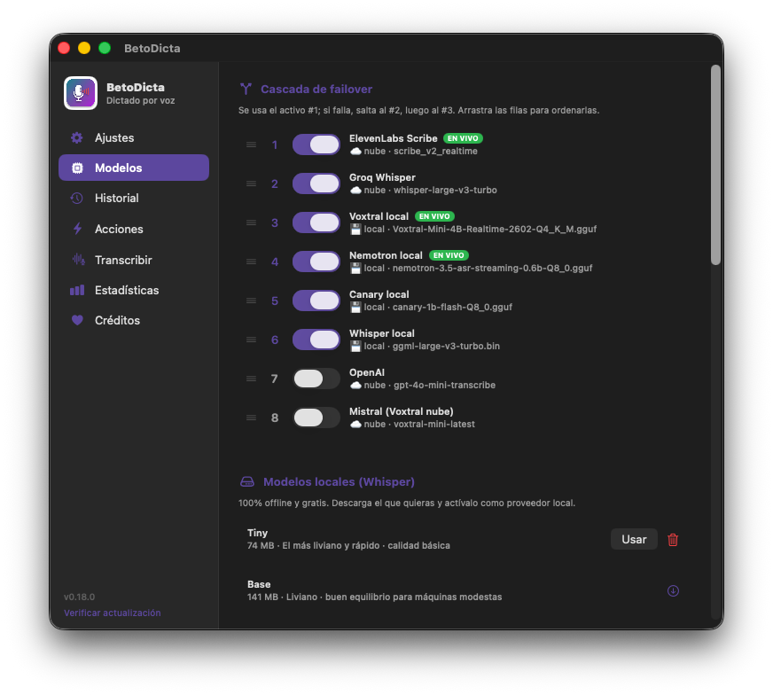

Todo el control de motores vive aquí:

> Los motores locales (whisper.cpp, llama.cpp, transcribe.cpp) se mantienen **al día** con sus proyectos base: cada versión de BetoDicta trae las últimas mejoras de rendimiento y correcciones, sin que tengas que hacer nada ni volver a descargar tus modelos.

**Descargar modelos locales**
- Cada familia tiene su sección: Whisper / Voxtral / Nemotron / Canary.
- Clic en el botón de descarga (⬇) → verás la barra de progreso.
- La descarga **sigue en segundo plano** aunque cambies de pestaña o cierres la ventana.
- El **✕** junto a la barra cancela la descarga.
- Al terminar: botón **"Usar"** → ese modelo queda elegido para su proveedor y el proveedor se activa.
- La etiqueta **EN USO** marca el modelo activo de cada familia; el 🗑 borra el archivo del disco.

**API keys de la nube**
- Sección "Proveedores en la nube": pega tu key (⌘V funciona), pulsa **Guardar** → verás **"Guardado ✓"** y el estado pasa a **"conectado"**.
- Cada proveedor trae un icono **ⓘ** con una explicación (qué es, si es gratis, si va en vivo) que aparece **al instante** al pasar el mouse (o al hacer clic), y un enlace **"Conseguir clave"** que abre la **página oficial** donde sacas tu API key — así no pierdes tiempo buscándola. Lo mismo en *Ajustes → Conectar más IAs* para las IAs de chat.
- El ojito 👁 muestra/oculta la key. Las keys viven **solo en tu Mac** (`~/.betodicta/.env`).
- Elige el modelo de cada proveedor en su selector (por ejemplo, ElevenLabs: `scribe_v2_realtime` para texto en vivo, o `scribe_v2` / `scribe_v1` por lotes).

**Muchos motores de transcripción — varios GRATIS y otros de pago premium**:
- **Nube compatible-OpenAI**: ElevenLabs, **Groq Whisper (gratis, 2000/día)** ⭐, OpenAI, Mistral (Voxtral), **Fireworks (Whisper)**.
- **Nube con API propia** (cada uno con su adaptador): **Hugging Face (Whisper, capa gratuita)** ⭐, **Deepgram (Nova)**, **AssemblyAI (Universal)**, **Gladia (10 h/mes gratis)**, **Speechmatics (480 min/mes gratis)**, **Cloudflare Workers AI (Whisper, 10 000 llamadas/día gratis)**. Cloudflare pide tu **Account ID** además de la key (campo aparte en su tarjeta).
- **De pago, calidad premium**: **Soniox** ⭐ (el mejor valor, ~$0.10/h, multilingüe nativo con excelente español latino y mezcla es/en) y **Azure AI Speech** (único con locale **es-EC de Ecuador**; pide la **región** además de la key). Los mejores si quieres máxima calidad en español.
- **Locales con detección inteligente**: **Ollama** y **LM Studio** aparecen como motor de transcripción **solo si tienen un modelo whisper** cargado. Si no lo tienen, la fila se oculta y el motor queda desactivado — nunca te ofrece algo que no puede escuchar. Para habilitarlo: `ollama pull whisper` (o carga un whisper en LM Studio) y reabre.
- Todos entran en la **cascada de failover** (arrástralos al orden que quieras) y su **precio por hora** ya viene puesto (los gratis en $0), ajustable con **"Poner valor"**. Los precios se **actualizan solos** desde una fuente mantenida (LiteLLM), sin gastar IA — igual que los de pulido.
- **En vivo**: por defecto los motores de nube transcriben por lotes (al soltar la tecla). Los que tienen WebSocket — **Deepgram, Soniox, AssemblyAI, Speechmatics y Gladia** — pueden transcribir **EN VIVO** (ves el texto mientras hablas) si lo activas en *Ajustes → Avanzado → "STT en vivo para la nube"*. En la lista de motores, los que van en vivo llevan una etiqueta **"EN VIVO"** (verde = activo; gris = lo soporta pero falta activarlo).

**El precio es POR MODELO** — cada modelo cuesta distinto, no el proveedor entero:
- Debajo del selector de modelo hay un campo **"Costo $/hora de \<modelo\>"**. Muestra el precio de referencia 2026 del modelo que tengas elegido, y **cambia solo** cuando cambias de modelo en el selector.
- Ejemplos reales: ElevenLabs `scribe_v2_realtime` = **$0.39/h** (en vivo) pero `scribe_v2` por lotes = **$0.22/h**; OpenAI `gpt-4o-transcribe` = **$0.36/h** pero `gpt-4o-mini-transcribe` = **$0.18/h**; Groq `whisper-large-v3-turbo` = **$0.04/h**. Los modelos locales = **$0** (gratis).
- ¿No te cuadra un precio? Escribe el tuyo y pulsa **"Poner valor"** → **"Guardado ✓"**. Ese valor manda para el cálculo de costo del mes. Borra el campo para volver al de referencia.
- El costo del mes (pestaña Estadísticas) usa el precio del **modelo que realmente se usó** en cada dictado — incluso si el failover cambió de modelo a mitad de camino.

## 10. Cambiar de motor al vuelo

Tres formas, de la más rápida a la más completa:

1. **Clic en el letrero del motor** (en el panel del notch, incluso mientras dictas) → eliges de la lista de activos → ese pasa a #1. Si estás dictando, **conmuta EN CALIENTE**: el motor nuevo recibe todo lo que llevas hablado y sigue desde ahí — no pierdes ni una palabra.
2. **Menú de la barra** (clic en el micrófono) → **"Proveedor principal"** → un clic y listo.
3. **Pestaña Modelos** → arrastra las filas de la cascada al orden que quieras.

## 11. Pestaña Ajustes

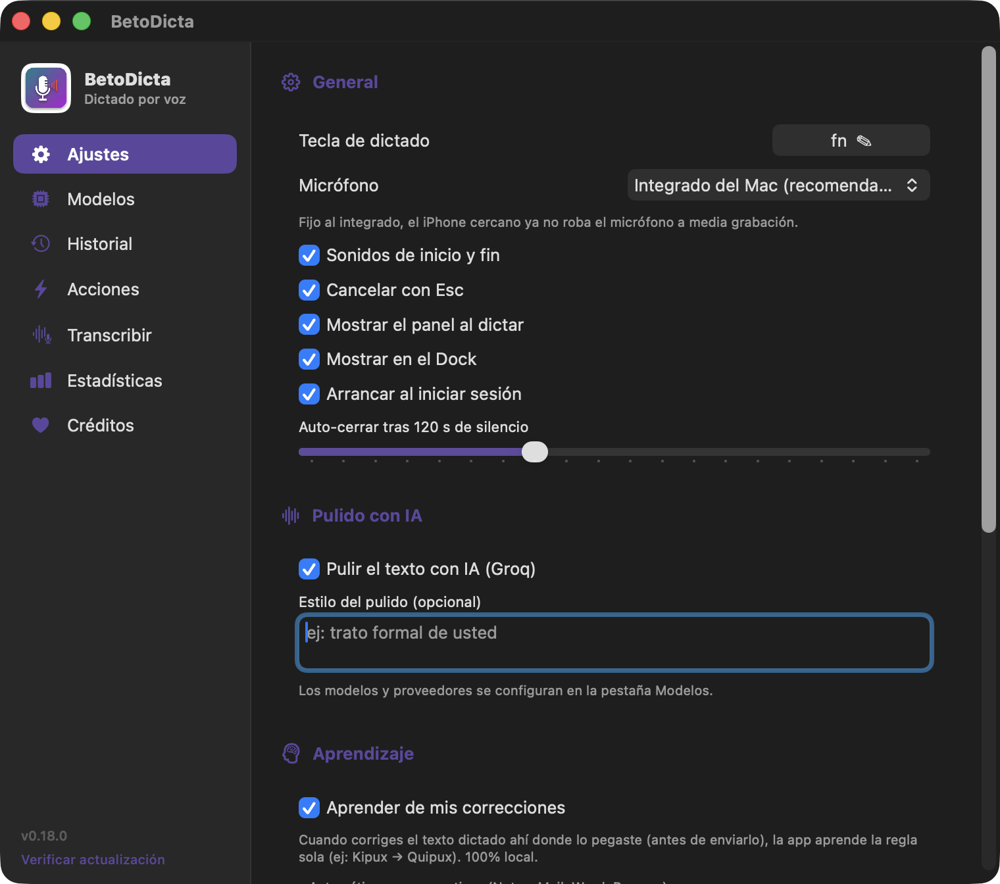

**General**
- **Tecla de dictado**: clic en el botón y pulsa la tecla o combinación que quieras (fn, F1–F12, ⌘⇧D…). Esc cancela la grabación del atajo.
- **Mantener presionado para hablar (push-to-talk)**: si lo activas, grabas **mientras tengas la tecla presionada** y al **soltarla** termina y transcribe — en vez del modo toque (un toque empieza, otro termina). Funciona con **fn** o combinaciones de modificadores (ctrl+opt…); no con F1–F12. Por defecto está apagado.
- **Doble pulsación para activar** (opcional): evita que un toque accidental abra el micrófono. En **modo toque**, pulsa dos veces rápido para empezar y una sola vez para terminar. Con **push-to-talk**, da un primer toque y **mantén la segunda pulsación** mientras hablas; al soltar termina. La rapidez admitida entre ambas pulsaciones se puede ajustar de **0,25 a 1 segundo**. Funciona con fn, combinaciones de modificadores y, en modo toque, también con F1–F12.
- **Micrófono**: por defecto usa el **integrado del Mac** — así tu iPhone cercano no "roba" la entrada por Continuity y te deja dictando al aire. Puedes elegir cualquier otro o el automático del sistema.
- **Sonidos de inicio y fin**: el "tink" al empezar y el "glass" al entregar.
- **Cancelar con Esc**: Esc a mitad del dictado descarta todo.
- **Mostrar el panel al dictar**: apágalo para modo ninja (dictas sin panel).
- **Mostrar en el Dock**: la app vive en la barra de menú; enciende esto si además la quieres en el Dock.
- **Arrancar al iniciar sesión**: BetoDicta se abre sola al prender el Mac.
- **Auto-cerrar tras N segundos de silencio**: el guardián que te salva si olvidas la tecla abierta (15–300 s).

**Al terminar el dictado** (opt-in, apagados por defecto)
- **Añadir un espacio al final**: separa dictados seguidos para que no queden pegados.
- **Pulsar Enter al terminar**: envía en chats (WhatsApp, Slack…) o salta de línea en editores.
- **Pulsar Shift+Enter al terminar**: salto de línea suave, sin enviar (excluyente con Enter).

**Pulido con IA**
- Pasa el texto por una IA que corrige puntuación y quita muletillas ("eh", "este…").
- **Elige la IA**: no tiene que ser Groq. Cualquiera conectada — **Groq, OpenAI, Mistral, OpenRouter, DeepSeek, xAI (Grok), Anthropic (Claude), Gemini (Google), Moonshot AI/Kimi K2.6** y **Kimi K3/K2.7 por cuenta**, además de varias opciones con capa gratis o modelos locales. El selector muestra **"proveedor · modelo activo"** y solo lista las conectadas; la misma IA puede participar en pulido, traducción, modos y asistente.
- **Elige el modelo de CUALQUIER proveedor** (no solo gateways): al elegir una IA aparece una fila **"Modelo"** con un botón **"Descubrir"** que trae su lista completa; eliges cuál usar al vuelo y se guarda por proveedor. Si el proveedor publica precios (ej. **OpenRouter**), cada modelo muestra su costo: **`$entrada/$salida por millón de tokens`** o **`gratis`** — así ves cuánto te costará antes de usarlo.
- **Failover de pulido** (si tienes 2+ IAs conectadas): despliega **"Failover de pulido (respaldo si uno cae)"** y ordena tus proveedores con las flechas. Igual que la cascada de voz: se intenta el **1º** (ej. Groq, el más rápido) y, si no responde (caído, sin cupo, error), salta solo al **2º**, luego al **3º**… (ej. OpenAI → OpenRouter → local). Si un modo tiene su **propia IA**, esa va primero y la cascada queda de respaldo. Así el pulido nunca se queda sin funcionar por un proveedor caído.
- **Glosario inteligente** (opt-in, *Ajustes → Avanzado*): a medida que tu glosario crece, mandarlo entero a la IA en cada dictado alarga el prompt y va más lento. Con esta opción, la app usa **embeddings** para enviar **solo los términos afines a lo que dictaste** (más los que aparecen literalmente) — prompt corto = **pulido más rápido**, y escala aunque tengas cientos de términos. Usa el mismo motor de embeddings que la búsqueda semántica (interno, Ollama o nube); la primera vez calienta los vectores en segundo plano.
- **Motor de embeddings — interno por defecto**: el glosario inteligente, el reconocimiento de modos y la búsqueda semántica usan embeddings. El recomendado es **Interno de BetoDicta** (`bge-m3`): corre en tu Mac, es gratis, privado y no exige instalar Ollama; el modelo se descarga una sola vez desde Ajustes. **Ollama** sigue disponible como alternativa local y también puedes elegir nube (OpenAI/Gemini/Mistral). Si **no hay ningún motor listo**, no pasa nada: la app salta esa capa y sigue con el glosario completo y el reconocimiento normal, sin bloquear el dictado.
- **Failover del pulido**: si un proveedor no responde (red caída, sin cupo), la app **reintenta una vez con conexión fresca** y, si sigue fallando, **salta al siguiente proveedor** de tu cascada; en el peor caso pega el texto original. Nunca se queda colgada.
- **Red siempre caliente (pulido rápido)** (*Ajustes → Avanzado*, default ON): si usas una **VPN** (WireGuard/OpenVPN/etc.) que "duerme" cuando está inactiva, el primer dictado podía tardar ~14s por rehacer el handshake. Ahora un **latido** cada 15s mantiene el túnel y la conexión **calientes**, y el pulido **reusa** esa conexión → rápido **desde el primer dictado**, aunque dictes cada varios minutos. Si el socket muriera igual, reintenta con conexión fresca. Funciona con cualquier VPN o ninguna, y **nunca frena el dictado**.
- **Voz del sistema (texto → voz)** (*Ajustes → Avanzado*): BetoDicta puede **leerte** respuestas en voz (Modo Agente). Eliges el **motor** con failover — si el elegido falla, cae al siguiente y **termina en la voz de macOS**, nunca se queda mudo:
  - **Voz de macOS** (default): gratis, local, sin setup. Eliges voz + velocidad.
  - **ElevenLabs — tu voz clonada**: tu voz "Bto" en la nube (usa tu `ELEVENLABS_API_KEY`), modelo `eleven_flash_v2_5`. Con **streaming por WebSocket** (opción, default ON) el audio **empieza a sonar en ~75-130ms** mientras se genera; si el streaming falla, cae al modo normal.
  - **Otros motores de nube**: **OpenAI, Google Gemini, Deepgram, Cartesia, Inworld, PlayHT, Azure**. Cada uno parametrizable (voz, modelo, y **streaming con/sin WebSocket por proveedor**) con tu propia key. Sin key → se salta al siguiente motor, nunca truena.
  - **Clon local**: tus voces **clonadas** corriendo 100% offline. Tienes una **biblioteca de voces**: agregas/subes/eliges cuál habla, y cada voz lleva su **persona** (cómo habla esa persona) — el Agente **redacta en ese estilo** antes de leerlo. Una misma persona puede conservar tres variantes intercambiables: **Calidad (XTTS)**, **⚖️ Equilibrada (Qwen3‑TTS/MLX)** y **⚡ Rápida (Piper/ONNX)**. Qwen3‑MLX está optimizado para Apple Silicon, empieza por chunks y no modifica el clon entrenado; ONNX habla casi al instante. Gratis, sin internet después de descargar el modelo.
  - **Preparar ⚖️ Equilibrada**: en la fila de una voz pulsa **Crear ⚖️**, elige una muestra limpia de 5–20 s y escribe **literalmente** lo que dice. El modelo 0.6B es el recomendado; 1.7B prioriza calidad y usa más RAM. El interruptor **stream** es por voz. *Inicio fluido* y tamaño de chunk también son editables. Runtime, caché y modelo quedan aislados bajo `~/.betodicta/voz-engine/`; **Quitar motor** los elimina sin tocar el Python ni los modelos de otras aplicaciones.
  - **Failover sin cambiar de persona**: puedes activar **“Si una variante falla, probar otra de la misma persona”**. Por ejemplo, si Equilibrada falla prueba Calidad/Rápida disponibles y recién después cae a macOS; nunca salta a la voz clonada de otra persona.
  - **Motor de voz** (para correr los clones): BetoDicta trae el suyo **aislado** — pulsas **"Instalar motor de voz"** (descarga ~3-4 GB de Python + IA, bajo `~/.betodicta/voz-engine/`, no toca tu sistema, borrable). Después, 100% local.
  - Si mantienes XTTS precargado, al reabrir BetoDicta **reutiliza** el servidor correcto en vez de cargar otra copia; al salir normalmente lo apaga y libera la RAM. Nunca debe quedar una cascada de servidores huérfanos consumiendo CPU/memoria.
  - La **voz de macOS** ya suena al instante (no necesita streaming); ElevenLabs, Deepgram y Cartesia usan streaming de nube. Qwen3‑MLX transmite PCM por `127.0.0.1`: en el mismo Mac no necesita WebSocket para empezar por chunks. El streaming se configura **por cada motor/voz**, no en forma global.
  - **Nube no significa descargable**: Deepgram Aura‑2 sirve para conversación rápida y español latino, Cartesia/ElevenLabs permiten voces de servicio, pero sus clones se usan dentro de sus APIs. No entregan las pesas para llevártelas offline. Para “entrenar en nube y descargar”, la ruta correcta es entrenar un modelo abierto (XTTS/F5/Qwen/Piper) en una GPU alquilada y después importarlo localmente.
  - Botón **"Probar voz"** usa el motor y la voz elegidos.
- **Paquete de voz portable**: una voz clonada se guarda/comparte como un **paquete autocontenido** (modelo + persona + instrucciones). Puede llevar **XTTS + referencia Qwen3‑MLX + ONNX** vinculados. Las pesas comunes de Qwen no se duplican dentro de cada voz: el otro Mac las descarga una vez. **⬆︎ Subir voz** lo mete a BetoDicta; **⬇︎** lo descarga para llevarlo. Libre y sin ataduras.
  - **Subir uno de fuera:** si el clon viene incompleto (solo el modelo, sin config/voz/persona), BetoDicta **arma lo que falta** solo. Si no trae **muestras** de la voz, te las pide (**➕🎙**). Si no trae **persona**, la **genera** transcribiendo las muestras (**🧠**).
- **Entrenar una voz nueva** (**🎓** en *Clon local*): creas un clon **desde cero** dentro de BetoDicta.
  1. Eliges una **carpeta con audios** de UNA persona + un **nombre**.
  2. BetoDicta **mide la duración** y te **recomienda** las etapas (menos de 1 h no sirve; 1-2 h → ~3000; 2-4 h → ~4000; 4-6 h → ~5000). **Tú decides** — todo editable.
  3. **Entrena** en segundo plano (verás el **progreso en vivo**: paso, %, y una **gráfica**).
  4. Al terminar, **compara los cortes** (elige el mejor por parecido a la voz real), **escucha** cualquiera, **elige** el que te guste (o **borra** los descartados), y sale tu **paquete portable** listo. La **persona** (cómo habla) se saca sola de los audios.
- **Aviso de privacidad**: al pulir con una IA de **nube** o un **gateway de terceros**, la app te recuerda que **tu texto sale de tu Mac** — no dictes datos sensibles (claves, tarjetas). Para que **nada** salga, usa una IA **local**. El aviso se puede ocultar en *Ajustes → Avanzado*. Si un gateway usa **http sin cifrar**, la API key **no se envía** (protección).
- **Conectar más IAs de chat** (despliega la sección): pega la API key de la que quieras (OpenRouter/DeepSeek/xAI…). Para los locales, pulsa **"Buscar"** (o préndelos y reabre) — la app encuentra el modelo cargado.
- **Kimi tiene dos accesos oficiales distintos**: **Moonshot AI · Kimi API** usa `MOONSHOT_API_KEY`, factura por tokens y ofrece Kimi K2.6; **Kimi Code · cuenta/plan** usa una key creada en tu consola de membresía, consume la cuota del plan y permite `k3`, `kimi-for-coding` o HighSpeed según tu nivel. Las claves y URLs no son intercambiables. Kimi Code está orientado a coding/agentes externos autorizados; para pulido o integración general de producto, usa Moonshot API. BetoDicta se identifica con su nombre real y no reutiliza cookies ni suplanta otra aplicación. Si un servicio no publica OAuth o una key de membresía para terceros, se usa exclusivamente su API oficial.
- **IA personalizada (gateway propio)**: para servidores/gateways que no están en la lista. Pones tu **URL base**, **API key**, el **esquema de autenticación** (Bearer, X-API-Key o un encabezado propio), **encabezados extra**, y el **modelo** (a mano o con "Descubrir modelos"). Botón **"Probar conexión"** y marcas si sirve **para pulir** y/o **para reconocer voz (transcripción)**. Un gateway marcado **para voz** (debe exponer `/audio/transcriptions` estilo OpenAI) aparece en la **cascada de Modelos** (apagado; actívalo y ordénalo ahí) y participa en el failover como cualquier motor. Cada gateway aparece también en el selector de pulido. El botón **"+"** trae **plantillas preconfiguradas** (ej. **Cloudflare Workers AI**): crea el gateway casi listo — solo reemplazas tu **Account ID** en la URL y pones el token.
  - **"Descubrir modelos"** trae **todos** los modelos del gateway de una vez (si tu URL base no lleva `/v1`, lo prueba solo y te avisa que la API está bajo `/v1` — súbelo a la URL para que el pulido funcione). Ya no eliges uno solo y listo: **cambia el modelo activo cuando quieras** desde *Ajustes → Pulido*, con el selector **"Modelo del gateway"** que aparece al elegir ese gateway — sin volver a abrir el editor.
- El **estilo del pulido** es una instrucción tuya opcional: "trato formal de usted", "estilo técnico", etc.

**Aprendizaje** — que la app aprenda de tus correcciones y (opcional) corrija por sonido. Es tan importante que tiene sus propias secciones: [14](#14-que-la-app-aprenda-de-ti-aprendizaje) y [15](#15-corrección-por-sonido-fonética).

**Multimedia**
- **Pausar música y videos al dictar**: pausa Spotify, YouTube, Music… y los reanuda al terminar.
- **Bajar el volumen al dictar**: además baja el volumen del sistema y lo restaura exacto.

**Avanzado** (plegado por defecto; se despliega al clic en **todo el título**)
- **Modo desarrollo**: anota detalles técnicos extra en el registro (para diagnosticar) y **desbloquea la bitácora de aprendizajes** en Estadísticas.
- **Buscar actualización al abrir** (encendido por defecto): al arrancar revisa en silencio si hay versión nueva y te lo muestra abajo-izquierda. Nunca instala nada sin permiso.
- **Autoactualizar** (apagado por defecto): si encuentra actualización al abrir, la baja e instala sola (la app se reinicia). Ver §20.
- **Salvaguarda anti-inyección** (apagado por defecto): protección extra por si usas **gateways de terceros**. Si el texto que devuelve la IA de pulido **se dispara de tamaño** o **mete comandos de shell** que tú no dictaste (por ejemplo un gateway malicioso), la app **pega tu dictado ORIGINAL** en vez del pulido. **Nunca bloquea ni borra**: en el peor caso pierdes el pulido, no tus palabras. Útil sobre todo si dictas en terminales. Las IAs de pulido conocidas (Groq, OpenAI, Anthropic…) no necesitan esto.
- **STT en vivo para la nube (WebSocket)** (apagado por defecto): si tu motor de transcripción #1 lo soporta (**Deepgram, Soniox, AssemblyAI, Speechmatics o Gladia**), con esto transcribe **EN VIVO** — ves el texto mientras hablas, en lugar de esperar a soltar la tecla. Necesita la key de ese proveedor. Apagado, transcriben por lotes como el resto.
- **Espera del pulido con IA**: cuánto esperar la respuesta antes de rendirse (10–60 s). La app ya reintenta sola ante cortes de red, y espera más para textos largos. Súbelo si tu conexión es lenta.

## 11 bis. Pestaña Asistente

Esta pestaña convierte a BetoDicta en un asistente por voz sin reemplazar su función principal. **Dictado, Modos, transcripción, pulido y voces siguen coexistiendo**; si apagas **“Activar el núcleo del asistente”**, lo anterior continúa igual.

**Presencia y personalidad**

- El nombre es libre: **Bto, Jarvis, Mamá** o el que quieras.
- Puedes escribir la personalidad completa: tono, trato, brevedad, vocabulario y forma de responder. La personalidad decide **cómo redacta**; la voz TTS decide **cómo suena**.
- Las frases de presencia son editables, **una por línea y con mínimo dos palabras**: *“oye Bto”*, *“oye Jarvis”*, *“oye mamá”*. La puntuación del STT no cambia la coincidencia: `Oye, Bto` funciona igual que `Oye Bto`. Los valores genéricos de una palabra (`oye`, `Bto`, `mamá`) se ignoran para evitar que un dictado corriente despierte al agente. Deben ir al inicio de un dictado ya iniciado con fn. Si dices solo la frase, queda listo el modo Agente para el siguiente dictado. BetoDicta **no mantiene el micrófono abierto en reposo**.

**Respuestas visibles y habladas**

- **“Responder al actuar, preguntar o no entender”** es independiente y reversible. Puedes elegir **Solo texto** o **Texto y voz**. La segunda opción utiliza exactamente el motor, clon y failover configurados en *Avanzado → Voz del asistente*; si TTS está apagado o falla, conserva la respuesta escrita y no detiene la acción. Una voz clonada puede tardar en generar su primer audio, pero el acuse corre en paralelo: **nunca retrasa la herramienta**.
- Cuando una intención es ambigua, el notch sigue mostrando el plan completo y el asistente también lo lee: *“¿Deseas traducir y enviar por correo? Pulsa fn una vez…”*. **fn o X cortan inmediatamente esa pregunta hablada** antes de continuar.
- Para una acción automática responde con una frase breve, por ejemplo *“De acuerdo, voy a abrir Safari”*. Para resultados verificables espera la evidencia: Música distingue *“estoy reproduciendo…”* de *“no pude reproducirlo automáticamente; abrí la búsqueda”*. Nunca afirma que envió, guardó o reprodujo algo si la herramienta no lo confirmó.
- Los resultados de un modo transformador dentro del Asistente —por ejemplo traducir o resumir— también pueden leerse con la voz elegida. Una respuesta vacía de IA/Hermes degrada a una explicación breve para que el asistente no quede mudo.

**Tres niveles de autonomía**

1. **Consultivo**: propone el plan y pregunta antes de usar cualquier herramienta.
2. **Asistido**: puede consultar, buscar, abrir aplicaciones/archivos y controlar música; confirma los cambios.
3. **Autónomo**: además puede crear elementos locales reversibles, como recordatorios, eventos, tareas o notas.

Los envíos de correo/WhatsApp, publicaciones, compras, borrados y cualquier acción externa sensible **siempre se confirman**, incluso en Autónomo. Una sola pulsación de **fn** confirma el modal; **X** rechaza únicamente la acción y conserva el texto.

**Cerebro y memoria**

- Las respuestas sencillas (hora, fecha, tareas, notas y última conversación) se resuelven **localmente y sin IA**.
- Para conversar puedes usar una IA conectada en BetoDicta —incluidos **Ollama o LM Studio**— y fijar proveedor/modelo solo para el asistente. Vacío usa la cascada global.
- **ChatGPT por cuenta (Codex oficial)**: aparece en **Modelos → IA de texto por cuenta (NO transcribe audio)**, en **Ajustes → Pulido → Conectar más IAs de chat** y en **Asistente → Cerebro y memoria**. Pulsa **Conectar en navegador**. Codex abre la autorización, conserva y renueva su propia sesión; BetoDicta **nunca lee tu contraseña, cookies, token ni `auth.json`**. Una vez conectada puedes elegirla para el **Asistente, pulido, traducción y la IA propia de cada Modo**, incluida la cascada de failover de pulido. Cada transformación corre en una sesión efímera, sin reglas del proyecto y en sandbox de solo lectura; las acciones reales siguen pasando por el planificador y las confirmaciones de BetoDicta.
- **Modelo Codex elegible**: BetoDicta lee únicamente el catálogo público de modelos que el cliente Codex ya descargó (no sus credenciales) y muestra **Automático, GPT-5.6 Sol, Terra, Luna** y los modelos de compatibilidad disponibles para esa cuenta. También eliges razonamiento **bajo, medio, alto o extra alto**. Automático puede cambiar de modelo según la solicitud; una opción explícita fija el modelo que BetoDicta solicita. Para pulido rápido y repetible suele convenir **Luna + bajo/medio**; para un asistente más cuidadoso, **Sol + medio/alto**.
- **La cuenta ChatGPT no se convierte en API**: OpenAI mantiene separados ChatGPT y la plataforma API. La ruta Codex consume el cupo de Codex de tu plan; una conexión OpenAI de la pestaña Modelos sigue necesitando su propia clave y facturación API. Codex CLI entrega texto, pero **no un endpoint de embeddings**: para glosario inteligente, semántica e historial usa el motor Interno de BetoDicta/Ollama, o una API de embeddings. Tampoco convierte el plan en STT/TTS. Consulta [ChatGPT frente a API](https://help.openai.com/en/articles/9039756-billing-settings-in-chatgpt-vs-platform) y [Codex con tu plan ChatGPT](https://help.openai.com/en/articles/11369540-using-codex-with-your-chatgpt-plan).
- **Hermes** puede ser cerebro principal o de respaldo. Eliges cuál va primero y el interruptor de failover prueba el otro si falla. BetoDicta le pide la respuesta **sin cederle herramientas**; las acciones pasan por el planificador y la política de autonomía de BetoDicta.
- La memoria corta vive en `~/.betodicta/agente_memoria.json`, guarda exactamente el número de turnos elegido (1–30) y se puede borrar con un clic. Un interruptor separado decide si se adjunta como contexto al cerebro: si ese cerebro es una IA de nube, el contexto necesario se envía a ese proveedor; apagado, el archivo y los seguimientos deterministas permanecen locales.
- Los seguimientos inequívocos reutilizan la última respuesta: después de pedir una redacción puedes decir *“mándaselo a Alberto por WhatsApp”* o *“tradúcelo al inglés”*. El nuevo plan conserva la confirmación obligatoria del envío; una narración corriente nunca hereda texto en silencio.

**Herramientas nativas y pasarela Apple**

- **Aplicaciones**: inventaría las apps instaladas y puede abrir la que nombras; el pegado automático conserva las salvaguardas del modo Aplicación.
- **Órdenes largas y borradores**: estructura localmente destino, tipo de documento, destinatario, asunto y contenido. Ejemplo: *“Oye Bto, abre Gmail y escribe un correo bien estructurado para alberto@example.com: prepara el programa del evento”*. Primero redacta con el modo Correo, luego abre un **borrador** de Gmail con campos separados. Mail y Outlook funcionan igual. **Nunca pulsa Enviar**; toda comunicación externa conserva la confirmación obligatoria. La herramienta se puede apagar por separado.
- **Documentos en cualquier app**: *“abre Word y crea un oficio completo…”* reutiliza el modo Oficio y el inventario real de aplicaciones: redacta, abre Word, crea el documento y coloca el resultado. Para una web propia, crea un modo Acción con su nombre y URL (por ejemplo Quipux); el asistente abre la página y deja el texto en el portapapeles, sin adivinar formularios ni pulsar botones.
- **Archivos**: busca con Spotlight dentro de tu carpeta de usuario. El selector previo muestra solamente coincidencias razonables **por nombre** (frase completa y palabras), para que un archivo cuyo contenido menciona “informe final” no aparezca con un nombre engañoso como `MANUAL.md`. Si no hay un nombre convincente, abre Finder con la búsqueda completa. Si dices *“busca el archivo informe final y muéstralo en Finder”* o *“mostrar en Finder el archivo informe final”*, abre directamente la búsqueda nativa con la consulta visible y **todos** sus resultados. Además entiende *“crea un archivo llamado agenda: …”*: conserva el texto y abre el selector nativo para que tú decidas nombre y ubicación. Nunca interpreta una ruta dictada, sobrescribe en silencio ni ejecuta el archivo como comando.
- **Capturas de pantalla**: entiende pantalla completa/principal, ventana, selección y los cuatro cuadrantes. Puedes pedir Escritorio, Descargas, Documentos o el selector nativo; nombre, portapapeles y abrir al terminar son opcionales. Ejemplos: *“Oye Bto, haz una captura de una sección, guárdala en Descargas con el nombre informe y cópiala al portapapeles”* o *“Haz una captura de una sección, guárdala en Descargas con el nombre «informe», cópiala y ábrela”*. La segunda forma funciona sin activador: BetoDicta muestra el plan y una pulsación de **fn** lo confirma. **“Cópiala”** basta para solicitar el portapapeles. Nunca sobrescribe un archivo: si el nombre existe, añade un número.
- **Grabación de pantalla**: *“graba la pantalla durante 20 segundos con micrófono y guarda en Documentos”* se inicia y se detiene sola. Si dices *“graba hasta que yo la detenga y guarda en mis Documentos”*, BetoDicta empieza directamente —sin la barra ambigua de macOS— y conserva el destino solicitado. Para terminar y guardar pulsa **una sola vez** tu tecla de dictado, aunque uses doble-fn para iniciar, o elige **■ Detener y guardar grabación** en el menú de BetoDicta. El resultado siempre termina en `.mov`. La duración predeterminada, micrófono y visualización de clics son configurables. La primera vez debes autorizar **Privacidad y seguridad → Grabación de pantalla**.
- **Protección de grabaciones largas**: mientras continúa, BetoDicta cierra fragmentos reproducibles cada **1, 5, 10, 15 o 30 minutos** (5 min recomendado) y los une sin recodificar al detener. Si la app o el Mac se interrumpen, al próximo arranque recupera automáticamente los fragmentos ya cerrados; como máximo queda expuesto el fragmento que estaba escribiéndose. Los respaldos transitorios viven con permisos privados en `~/.betodicta/grabaciones-en-curso/` y se eliminan después de consolidar correctamente.
- **Interfaz fuera de la toma**: justo antes del primer fotograma BetoDicta oculta el notch y bloquea parciales, flashes y respuestas tardías para que no vuelva a aparecer durante la captura o grabación. Solo lo restaura cuando macOS termina o cancela la operación.
- **Captura/grabación → WhatsApp**: *“toma una captura y envíala por WhatsApp a Alberto”* o *“graba la pantalla, guarda en mis Documentos y envíala por WhatsApp a Alberto”* conserva todas las acciones. En **Ajustes → Asistente → Capturas y grabaciones** eliges la política: **solo abrir y dejar en el portapapeles**, **pegar en el chat sin enviar** (recomendado) o **pegar y autoenviar**. El autoenvío nunca se activa por una frase: debe quedar habilitado expresamente. Antes de pulsar el único botón accesible llamado **Enviar**, BetoDicta compara la interfaz anterior y posterior al pegado y exige evidencia de que apareció una vista previa nueva del adjunto; si no puede demostrarlo, lo deja preparado. Así no envía por accidente un texto que ya estaba escrito en el chat. Además, cualquier Enter automático pendiente de otro dictado queda bloqueado durante la preparación. Para grupos o chats sin identificador público, abre WhatsApp y conserva el archivo en el portapapeles.
- **Recordatorios y Calendario**: crean el elemento mediante **EventKit**, la API nativa de macOS, después de tu permiso y según el nivel de autonomía. Ya no dependen de simular ⌘N/⌘V.
- **Atajos Apple / Siri**: Siri no ofrece una API pública para recibir una orden de texto arbitraria. BetoDicta usa la pasarela oficial de **Atajos**: eliges un atajo existente y le entrega el texto. Está apagado por defecto y siempre se trata como acción externa que requiere confirmación.

**Modo Música con failover**

- Entiende órdenes como *“modo música, pon una canción cualquiera de Julio Jaramillo”*, *“reproduce en Spotify música andina”*, *“modo música, busca Julio Jaramillo”* o *“pon música”*.
- La cascada es ordenable: **Apple Music → Spotify → YouTube Music → YouTube**, más SoundCloud/Bandcamp y los servicios propios que agregues. Los no disponibles se saltan.
- **“Pon/reproduce” y “busca” no son lo mismo**: *“pon Julio Jaramillo”* intenta reproducir la primera coincidencia; *“busca Julio Jaramillo”* únicamente muestra resultados y nunca inicia una pista. La intención viaja dentro del plan, incluso si el Asistente recortó el verbo de la consulta.
- *“Pon música”* sin artista elige por defecto una pista **aleatoria** de la biblioteca. Si Música estaba cerrada, BetoDicta espera de forma acotada a que la app y su biblioteca estén listas, reintenta y solo responde que está reproduciendo cuando el estado nativo es **playing**. Para no confundir muestras de clonación con canciones, primero exige duración musical y artista informado; si tu biblioteca no tiene esos metadatos, degrada gradualmente. En *Ajustes → Asistente → Modo Música* puedes cambiarlo a **Reanudar lo último**.
- En Apple Music, una consulta prueba primero la biblioteca local. Si no existe allí, BetoDicta consulta por HTTPS el **Search API público oficial de Apple**, descarta controles viejos/no visibles, abre el primer resultado en Música y hace doble clic en la pista exacta mediante el permiso normal de **Accesibilidad**. Verifica el `trackId`, título/artista y el control **Pausar** de esa misma fila; MediaRemote queda como respaldo bajo carga alta. *“Busca”* usa el ⌘F nativo de Música, sin iniciar una pista ni crear el elemento fantasma “AutoPlay”. Si el permiso, la red o la interfaz fallan, no inventa éxito: continúa por la cascada y abre la búsqueda.
- BetoDicta trae firmado el Atajo opcional **“BetoDicta · Reproducir música”**. En cada Mac puedes pulsar **Instalar…** y confirmar su importación una vez (restricción de seguridad de macOS); también puedes editarlo o sustituirlo. Está apagado como primera ruta por defecto porque un Atajo basado solo en la biblioteca puede elegir una pista distinta; la ruta de catálogo verificable es la predeterminada.
- MusicKit completo exige una identidad de desarrollador con el servicio MusicKit. BetoDicta no incrusta tokens ni suplanta Siri: usa el buscador público, la app Música visible y tu autorización local de Accesibilidad. Siri sigue siendo una herramienta separada porque Apple no ofrece una API pública para inyectarle texto arbitrario.
- Spotify no ofrece por AppleScript una operación de búsqueda+reproducción. Para *“reproduce en Spotify…”*, BetoDicta abre la búsqueda visible, localiza el primer botón **Reproducir** mediante Accesibilidad (con respaldo visual limitado a la ventana de Spotify), lo activa solo con Spotify al frente y verifica `player state`; *“busca en Spotify…”* se queda en los resultados. Si el botón no puede verificarse, no hace un clic a ciegas ni afirma éxito. En todos los proveedores, el resultado diferencia **reproduciendo**, **búsqueda abierta** y **solo aplicación abierta**.
- En **YouTube Music**, BetoDicta busca primero una app o PWA instalada con ese nombre; no inyecta el identificador de Brave, por lo que también admite una PWA creada desde Chrome/Edge u otra app equivalente. Escribe la consulta en el control accesible de la propia app, activa el primer resultado etiquetado **Reproducir** y confirma dentro de esa misma ventana que la barra cambió a **Pausar** y que la pista/álbum corresponde. Si no hay app o no responde, abre la búsqueda HTTPS en el navegador y repite el control. *“Busca en YouTube Music…”* solo deja los resultados visibles y no cambia la pista que ya sonaba. Sin permiso de Accesibilidad, degrada a búsqueda visible y nunca anuncia una reproducción que no pudo comprobar.
- Un proveedor propio lleva nombre + URL HTTPS con `{q}` (por ejemplo `https://servicio.example/buscar?q={q}`). HTTP solo se admite para localhost.

**Rutinas**

Cada rutina tiene frases propias y una lista ordenada de pasos: música, aplicación, URL, Atajo, tarea/nota local, recordatorio, evento, archivo, captura o grabación de pantalla. Usa `{texto}` para insertar lo que digas después del nombre. Ejemplo: una rutina *“empezar oficina”* puede abrir Outlook, buscar un archivo y poner una playlist. El riesgo de toda la rutina es el del paso más sensible; por eso una rutina con Atajo nunca se autoejecuta sin confirmación. Las URLs deben ser HTTPS (HTTP solo para un servicio local).

El diagnóstico detallado queda en `~/.betodicta/logs/agente.jsonl`; los Modos mantienen además `~/.betodicta/logs/modos.jsonl`. Para una orden estructurada registra ruta, etapas, destino, destinatario, asunto/nombre de archivo, confirmación y resultado; el evento de correo marca expresamente `enviado: false`. No se guardan API keys en esos registros.

## 12. Pestaña Acciones

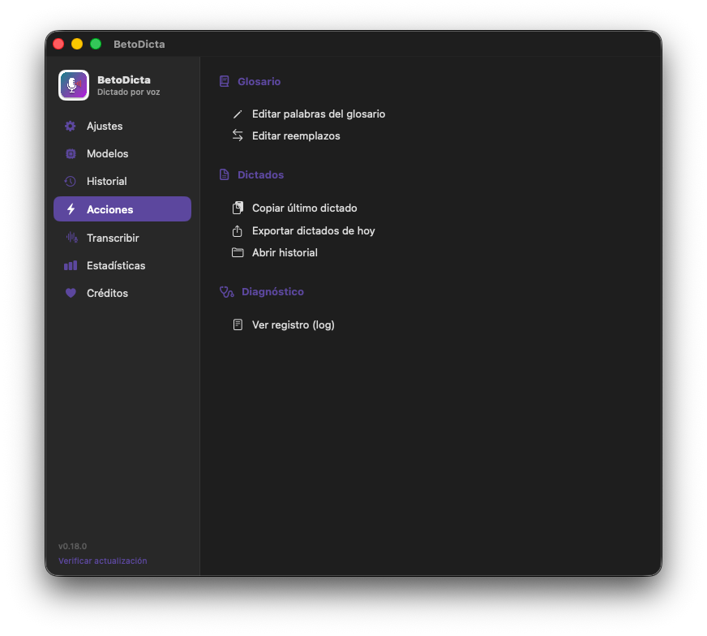

Los accesos rápidos de mantenimiento:

- **Glosario**: abre los editores de palabras del glosario y de reemplazos (ver la sección siguiente).
- **Dictados**: copiar el último dictado, exportar los de hoy a Markdown, abrir la carpeta del historial.
- **Diagnóstico**: ver el registro (log) de la app — útil si algo falla y quieres reportarlo.

## 13. Glosario y reemplazos

El corazón de "que escriba bien mis palabras":

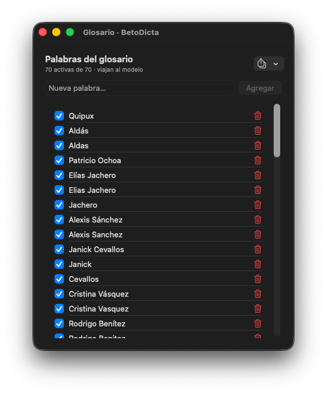

**Glosario (keyterms)** — Configuración → Acciones → *Editar palabras del glosario*. Una palabra o frase por línea (nombres propios, siglas, términos técnicos: *Quipux, SENESCYT, Aldás…*). El glosario **viaja a TODOS los motores**: ElevenLabs lo recibe nativo, Whisper/Groq/OpenAI como contexto, Voxtral dentro de la instrucción. Editas el archivo y aplica desde el siguiente dictado.

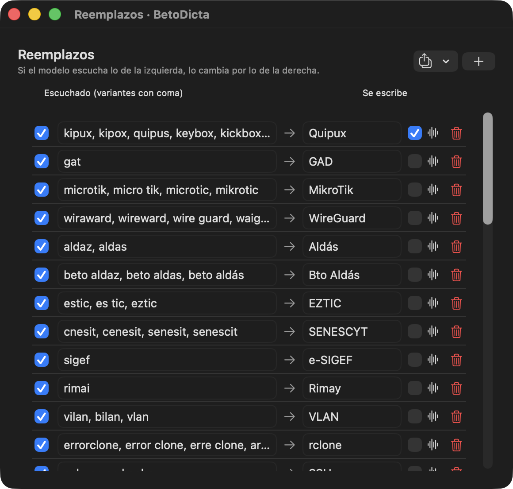

**Reemplazos** — Configuración → Acciones → *Editar reemplazos*. Correcciones automáticas DESPUÉS de transcribir, para todos los motores siempre: si un motor escribe "Kipux", la regla `kipux, kipox, quipus… → Quipux` lo corrige antes de pegar.

Cada fila del editor tiene, de izquierda a derecha:
- ☑️ **Activo**: apaga la regla sin borrarla.
- **Escuchado** (variantes separadas por coma): todo lo que el motor podría escribir mal.
- **Se escribe**: cómo debe quedar.
- 🔉 **Escuchar**: la Mac pronuncia el término (solo para oírlo — la corrección no usa audio).
- 🔍 **Probar**: escribe una palabra y te dice si la [fonética](#15-corrección-por-sonido-fonética) la corregiría (y por qué).
- 🔊 **Por sonido**: casilla de la onda — activa la corrección fonética para ESE término.
- 🗑 **Borrar**.

Soporta expresiones regulares para cazar familias enteras de variantes. Importar/Exportar tus reglas está en el menú de compartir (arriba a la derecha).

**Coincidencia por audio (experimental)** — arriba del editor hay un interruptor "Coincidir por audio". Con él encendido, cada fila muestra un **🎙** para **grabar tu voz** diciendo el término (varias veces = mejor) y una casilla **Abc** para marcarlo como **sigla** (DGTIC). Al dictar, la app reconoce el término por **cómo suena tu voz** —además del texto— y corrige aunque el motor lo escriba muy distinto. Es experimental: se calibra con "probar por voz" y una **raya al dictar** ajustable, y solo actúa en dictados ≤30 s. Apagado no cambia nada.

**¿Cuál usar?** Los dos: el glosario ayuda al motor a acertar a la primera; los reemplazos son la red de seguridad que corrige lo que se escape.

## 14. Que la app aprenda de ti (aprendizaje)

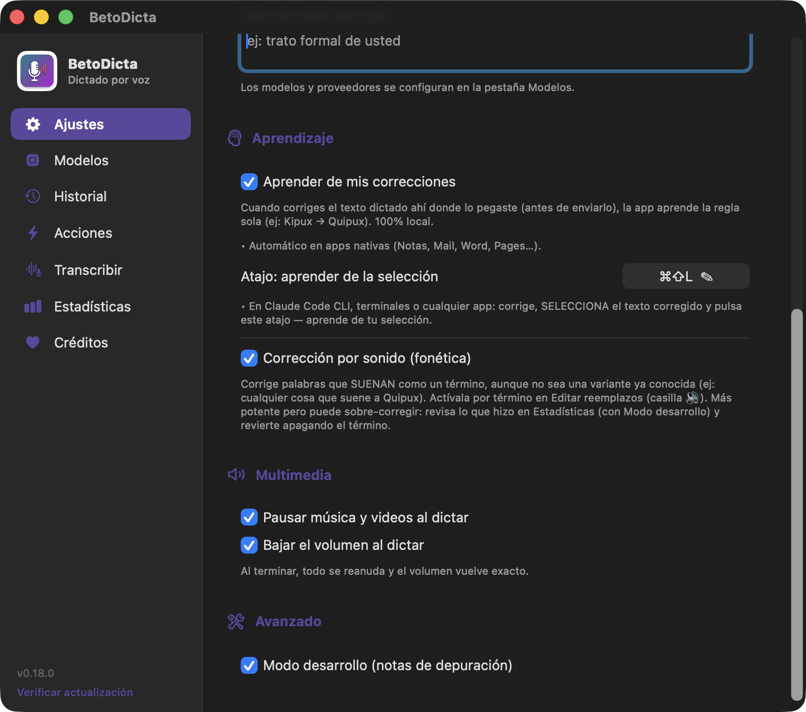

En vez de que edites reglas a mano, BetoDicta puede **aprender sola** de las correcciones que ya haces. Se activa en **Ajustes → Aprendizaje → "Aprender de mis correcciones"** (viene apagado; es opt-in).

**Cómo funciona**
1. Dictas y la app pega el texto donde está tu cursor.
2. Ahí mismo, **antes de enviar**, corriges una palabra que salió mal (ej. borras "Kipux" y escribes "Quipux").
3. Un vigilante lee ese campo, compara lo pegado con lo que quedó, y si el cambio es del tipo *"palabra rara → palabra parecida"*, **aprende la regla solo** (`Kipux → Quipux`). La próxima vez ya te la corrige.
4. Todo **100% local** — nada sale de tu Mac. La regla nueva se guarda en tus reemplazos.

**Dónde funciona automático**
- En **apps nativas** (Notas, Mail, Word, Pages, TextEdit…) es 100% automático: exponen su texto por Accesibilidad y el vigilante lo lee sin que hagas nada.

**Dónde necesitas el atajo (Claude Code CLI, terminales, apps Electron)**
- iTerm, Terminal, Warp, Claude Code CLI y demás **no exponen su texto** por Accesibilidad (dibujan sobre un lienzo). Ahí el vigilante no puede leer solo.
- Solución: corrige la palabra, **SELECCIONA el texto corregido** y pulsa el atajo **⌘⇧L** (configurable en la misma tarjeta). La app copia tu selección, la compara con lo último que dictó y aprende igual.

**Salvaguardas** — solo aprende cambios "palabra rara → parecida" (distancia de edición corta); ignora palabras comunes y muletillas para no inventar reglas basura.

**Verlo y deshacerlo** — activa **Modo desarrollo** (Ajustes → Avanzado) y ve a **Estadísticas**: abajo aparece **"Aprendizaje (debug)"** con las correcciones de las últimas 24 h y el total histórico. Cada una trae un botón **↺** para revertir esa regla al instante (el 🔊 marca las que vinieron por sonido).

## 15. Corrección por sonido (fonética)

Los reemplazos normales corrigen variantes que ya conoces. La **corrección por sonido** va más allá: corrige palabras que **SUENAN** como un término tuyo, aunque nunca las hayas visto antes (cualquier cosa que suene a *Quipux* → *Quipux*).

**Se enciende en dos niveles** (los dos, a propósito — es potente y conservadora):
1. **Global**: Ajustes → Aprendizaje → **"Corrección por sonido (fonética)"** (opt-in, apagada por defecto).
2. **Por término**: en *Editar reemplazos*, marca la casilla de la onda **🔊** en el término que quieras (solo ese usará el sonido). Si el interruptor global está encendido pero **ningún término tiene el 🔊**, no corrige nada — por eso hay que marcar el término.

**Cómo funciona por dentro (Metaphone español)**
Convierte cada palabra en un código de **cómo suena**, normalizando las consonantes que comparten sonido:

| Suena igual | Se normaliza a |
|---|---|
| k / qu / c (ca,co,cu) | **K** |
| b / v / w | **B** |
| s / z / c (ce,ci) | **S** |
| j / g (ge,gi) | **J** |
| ll | **Y** · x → **KS** · ch → **X** · h → (muda) |

Así *Quipux*, *Kipux* y *Guipux* caen en códigos casi idénticos (`KIPUKS`, `GIPUKS`).

**Triple candado (para no sobre-corregir)** — una palabra solo se cambia si cumple las tres:
1. tiene 3+ letras y no es ya el término correcto,
2. su **sonido** está a distancia ≤ 1 del término (suena casi idéntico),
3. su **escritura** no está muy lejos (≤ 40 % de su largo), y no es una palabra común.

**Ejemplos reales** (con el término *Quipux* marcado 🔊):

| Palabra | ¿Qué hace? |
|---|---|
| Kipux, Guipux, Quibux, Whipux | ✅ corrige → **Quipux** |
| cripto, kilos, equipo | ❌ las deja igual (suenan distinto) |

**Reversible siempre** — cada corrección por sonido queda registrada (con 🔊) en Estadísticas → Aprendizaje (debug), con su botón **↺**. Y si un término empieza a corregir de más, basta **quitarle la casilla 🔊** en Editar reemplazos: vuelve a ser un reemplazo normal.

> ⚠️ Es la función más agresiva de la app. Un término puede sonar como muchas palabras; enciéndela término por término y revisa en Estadísticas lo que hizo.

## 16. Traducir al dictar

Menú de la barra → **"Traducir al dictar"** → elige idioma (inglés, portugués, francés…). Dictas en español y se pega traducido. Los términos de tu glosario NO se traducen (nombres propios quedan intactos). Necesita key de Groq. **"Desactivado"** vuelve al español normal.

> **Cancelar de raíz.** Cuando el agente está pensando o hablando (Hermes, IA local o nube), puedes cortar TODO al instante: pulsa **Esc** o **toca el notch**. Se cancela la consulta en curso, se ignoran respuestas que vengan tarde y se corta el audio (voz de macOS, nube y streaming local). Igual que la X cancela el dictado. No dependes de esperar a que termine.
>
> **Interrumpir (barge-in).** Mientras la IA responde, pulsa **fn** y la interrumpes para decirle otra cosa: se corta lo actual y grabas lo nuevo, que **sigue la misma conversación** (el agente conserva el contexto). Como cortar a alguien a media frase para redirigirlo.

## 16 bis. Modos — qué hacer con lo dictado

Un **modo** decide cómo se procesa tu dictado. Se configura en **Ajustes → Modos** y se cambia de dos maneras:

- **Switch manual**: clic en la etiqueta del modo (**notch**, arriba-izquierda) o **menú de la barra → Modo**.
- **Switch por voz (automático)**: al empezar a hablar, di el modo. Puedes continuar de inmediato o hacer una **pausa corta**. Ejemplo: *"modo traductor… (pausa) …buenos días, ¿cómo estás?"*. En cuanto lo reconoce, **el notch cambia de nombre y color con un doble parpadeo** — esa es la señal de "te escuché" — y tú sigues hablando; la pausa **confirma el modo, pero no termina la grabación**. Funciona con cualquier motor (Groq incluido): los "oídos en vivo" son el transcriptor disponible durante la grabación, mientras tu motor real hace la transcripción definitiva al soltar.

**Cada modo tiene su COLOR** en el notch (letrero + un tinte suave del fondo): dictado = negro neutro, traducir = celeste, agente = magenta, tarea = naranja… Los modos que tú crees reciben color automático (estable), o eliges uno con el **selector de color** del editor de modos. Así sabes de un vistazo en qué modo estás.

La detección por voz tiene varias capas de tolerancia (el micrófono a veces escucha *"molde traductor"*, *"moto agente"* o incluso *"la gente"* por *"agente"* — igual lo entiende cuando aparece como orden al inicio). Un único resolver aplica este orden: **cadena explícita → frase exacta → frase difusa → pedido natural → modo confirmado durante la pausa → semántica local → IA árbitro opcional → app/sitio → respaldo captado en vivo → modo manual**. La detección difusa es local, conservadora y exige una palabra inicial segura; expresiones normales como *"moda de invierno"*, *"modo de empleo"*, *"necesito revisar el correo"* o *"todo agente tiene un jefe"* no activan nada. Cada grabación tiene una identidad y un modo normal congelados: resultados tardíos de otra grabación no pueden contaminarlos.

**Pedidos naturales y cadenas de 1 a N etapas.** Puedes decir *"por favor, ayúdame a traducir lo siguiente: …"*, *"resume, traduce al inglés y envía por correo"*, *"traduce al quichua y mándaselo a Alberto por WhatsApp"* o *"Oye Bto, crea un verso sencillo y después mándaselo a Alberto por WhatsApp"*. BetoDicta separa **transformaciones** (redactar, resumir, formalizar, traducir…) de **destinos** (correo, WhatsApp, buscador…), conserva idioma y destinatario, genera primero el contenido pedido y recién después abre el destino. Las cadenas explícitas que empiezan con *"modo"* siguen siendo ágiles; los pedidos naturales muestran primero el plan. Un envío externo siempre pide confirmación y prepara el borrador: la IA no puede sustituir esa acción diciendo solamente *"lo enviaré"*.

**Órdenes estructuradas para trabajar en apps.** La misma base entiende instrucciones más largas sin mandar toda la frase a una IA para decidir la ruta:

- *“Oye, Bto, abre Gmail y escribe un correo bien estructurado para alberto@example.com: necesitamos preparar el programa del evento”* → **Correo estructurado → borrador Gmail**, con destinatario, asunto sugerido y cuerpo separados.
- *“Abre Outlook y escribe un correo. Asunto: Reunión. Cuerpo: Nos vemos mañana a las diez”* → entrega un enlace `mailto:` directamente a Outlook y comprueba que apareció una ventana nueva con sus campos reales. Si la app no está o no confirma el borrador, abre Outlook web. **Nunca lo envía solo.**
- *“Abre Word y crea un oficio completo con encabezado, fecha, destinatario y cierre solicitando apoyo…”* → **Oficio → Word**. BetoDicta crea un documento mediante la automatización nativa de Word, coloca el texto y lo vuelve a leer antes de anunciar éxito. La primera vez, macOS puede pedir permiso en **Privacidad y seguridad → Automatización → BetoDicta → Microsoft Word**; si falla, el oficio completo queda respaldado en el portapapeles.
- *“Abre Quipux y crea un oficio: …”* → funciona cuando tú has creado un modo Acción llamado Quipux con su URL. En sitios sin API, abre y copia; no envía formularios a ciegas.
- *“Crea un archivo llamado agenda de mañana: comprar materiales y llamar a Rafael”* → muestra el selector de guardado y crea un `.txt` solo donde tú confirmes.

El reconocimiento de la **ruta y los campos es local y determinista**. La IA se usa únicamente para redactar/formalizar el contenido cuando el plan incluye Correo, Oficio u otro documento; si ninguna regla alcanza, recién entra el árbitro IA opcional ya existente. Un pedido sin destino como *“redacta un correo”* solo redacta: no abre una aplicación por su cuenta.

**Confirmación clara, sin perder el dictado.** Cuando una frase natural o ambigua propone un plan, el notch **se expande hacia abajo**, enumera lo entendido y muestra un extracto del texto que va a procesar: *1. Resumir · 2. Traducir al inglés · 3. Enviar por WhatsApp a Alberto*. Pulsa **fn una sola vez** para confirmar, aunque uses doble-fn para iniciar el dictado. Pulsa **X**, toca el notch o deja vencer el tiempo para rechazar **solo la interpretación**: el texto completo continúa con el modo normal; no se cancela. El tiempo es configurable (6–30 s).

**Semántica y último árbitro.** Si las reglas exactas no alcanzan, los embeddings comparan la zona inicial con los ejemplos de cada modo. Se exige tanto un **umbral** como una separación mínima entre el 1.º y 2.º candidato; un empate no se adivina. Como último recurso opcional, una IA de chat conectada puede clasificar únicamente la **zona de intención** y devolver un JSON de etapas validado contra el catálogo. Puedes elegir proveedor, máximo de palabras y timeout estricto. La IA nunca ejecuta el plan: todavía lo confirmas; si no existe, falla o tarda, el dictado sigue sin bloqueo.

Cada **Sí/No** de una propuesta queda en estadísticas locales. Si activas *"Aprender de mis Sí/No"*, BetoDicta ajusta el umbral semántico en pasos pequeños y acotados; no entrena en la nube ni relaja la confirmación de acciones externas.

**Motor de embeddings INTERNO (sin instalar nada).** La semántica (modos por significado, búsqueda por idea en el Historial y glosario inteligente) **ya no necesita Ollama**: BetoDicta trae su propio motor — el mismo modelo **bge-m3**, servido por la propia app. Solo descargas el modelo una vez (~417 MB, botón en `Ajustes → Motor de embeddings → ✓ Interno de BetoDicta`). Es rápido de verdad (**~7 ms por consulta**, medido; se precalienta solo al pulsar fn) y **duerme** tras 10 min sin uso para liberar memoria. Ollama, OpenAI, Gemini y Mistral siguen como opciones en el mismo selector.

En **Ajustes → Avanzado** puedes apagar el cambio en vivo, apagar la confirmación por pausa, elegir la pausa (por defecto **2,0 s**) y limitar cuántas palabras del inicio se consideran zona de comando (por defecto **8**). El resto del dictado nunca se examina como orden. Si dices únicamente *"modo agente"* y terminas, BetoDicta deja **Agente listo para el próximo dictado** en vez de llamar a la IA con un texto vacío.

Modos base:

- **Dictado** (por defecto): comportamiento de siempre (pulir + traducir si los tienes activos).
- **Correo / Oficio / Tarea / Nota**: reescriben tu dictado con ese formato. **Tarea** y **Nota** además **guardan** lo dictado en tu lista local (pestaña **Tareas y notas**).
- **Traducir**: traduce a un idioma que eliges de una **lista con banderita** (y puedes **agregar** los idiomas que quieras).
- **Asistente**: trata tu dictado como una instrucción y redacta la respuesta.
- **Agente** (asistente por voz): le pides algo hablando (*"modo agente, dime qué tareas tengo hoy"*) y te muestra la respuesta; también te **responde por voz** si TTS está activo. Conoce **tus tareas y notas**, tiene memoria corta parametrizable y puede usar herramientas según el nivel de autonomía. **Pegar la respuesta** es opcional y está apagado por defecto. Si no hay IA, aún resuelve las consultas y herramientas locales que conoce.
- **Música**: busca o reproduce mediante una cascada configurable de Apple Music, Spotify y servicios web. También admite proveedores propios.
- **Buscar**: no pega texto — **abre el buscador con tu consulta**. Vienen muchos: **Google, Bing, DuckDuckGo, Wikipedia, YouTube, Google Maps, Gmail** (buscar correo), **Outlook/Hotmail, Facebook, Amazon, MercadoLibre, X (Twitter), GitHub**, **Spotlight** (⌘Espacio en tu Mac) o una **URL propia** (usa `{q}` donde va el texto). Y puedes **agregar los tuyos** (nombre + URL con `{q}`) en el mismo modo Buscar — quedan para todos y se reconocen por voz (*"modo buscar wikipedia Ecuador"*). Sin IA.
- **Aplicación**: descubre automáticamente las aplicaciones instaladas en esta Mac. Di *"modo abrir aplicación Word, borrador del informe"*: abre **Microsoft Word**, crea un documento nuevo y coloca el texto. También entiende nombres largos (*"Microsoft PowerPoint"*) y alias comunes (*"Word", "Excel", "Chrome"*). Solo hace un inventario de nombres/bundle IDs; **no lee los datos privados** de las aplicaciones.
- **Acción**: abre una **app o página con tu texto** — borrador de **Gmail, Mail u Outlook**, **WhatsApp**, **Notas, Recordatorios, Calendario, Finder, Mensajes**, crear/buscar archivo, o **tu propia URL** (ej. Quipux: pones la URL con `{q}`). Los borradores nunca se envían solos. Ideal como modo propio con su frase de voz (ej. *"modo whatsapp …"*).

Cada modo de texto usa **su propia IA y su propio prompt** — o la IA global de Pulido (Buscar y Acción no usan IA). Puedes crear tus **propios** modos con el botón **+** (nombre, comportamiento, prompt/IA, o acción). Los que producen texto pueden además **guardarse** en Tareas o Notas (opción *"Guardar en"*).

**Tareas y notas** (pestaña propia): lo que dictas con Tarea/Nota se acumula ahí. Marca tareas como **hechas**, bórralas, **"Limpiar hechas"**, o agrega a mano. 100% local.

**Acciones a apps de Mac:** vienen creados modos de acción para Outlook, Correo, WhatsApp, Notas, Recordatorios, Calendario, Finder, Safari, Música, Terminal, Mapas, Spotlight y tu web. **Recordatorios y Calendario ya usan EventKit nativo** para crear el elemento con permiso; los esquemas compatibles precargan el texto. En apps sin API pública de creación (por ejemplo Notas), la app se abre y el texto queda respaldado en el portapapeles; el pegado automático depende de Accesibilidad y del campo que tenga foco.

**Abrir cualquier aplicación instalada:** el modo **Aplicación** complementa esos presets. Revisa `/Applications`, las aplicaciones del sistema y las del usuario, y guarda un catálogo rápido en memoria. Ejemplos:

- *"modo abrir aplicación Word, este es el borrador"* → abre Word, crea documento y pega.
- *"modo aplicación Safari, documentación de BetoDicta"* → activa Safari e intenta colocar el texto donde esté el cursor.
- *"por favor abre Word: acta de la reunión"* → al ser una petición natural, muestra primero el plan para confirmar.
- *"modo traducir inglés abrir aplicación Word, buenos días"* → traduce y después abre Word con el resultado.

En **Ajustes → Modos → Aplicación** puedes apagar por completo esta función, desactivar el pegado automático, decidir si Word/TextEdit/LibreOffice deben crear un documento nuevo y actualizar el inventario. BetoDicta espera hasta que la app sea realmente la ventana frontal; si no toma el foco o no acepta texto, **no escribe en otra app** y deja el contenido en el portapapeles. Si dos nombres coinciden, pregunta cuál abrir. Nunca pulsa **Enter**, nunca envía el texto y nunca ejecuta una ruta que no pertenezca al inventario. El pegado automático requiere el permiso de **Accesibilidad** de BetoDicta.

**WhatsApp con contactos:** en el modo WhatsApp puedes **importar** tu lista y/o usar tus **Contactos de Mac**. El import **auto-detecta el formato**: **vCard `.vcf`** (teléfono iPhone/Android, iCloud, Outlook), **CSV de Google/Gmail** (inglés o español), **CSV de Outlook/Edge**, o CSV/JSON simple — y te dice cuántos **válidos/inválidos** importó. Di *"modo whatsapp, enviar a Alberto, hola qué tal"* → busca a Alberto y abre su chat con el texto; si hay varios, **eliges en un modal** (los más probables primero). Si el STT oye algo cercano (*"Adalberto"* por *"Alberto"*), hace una coincidencia local aproximada pero **siempre te pide confirmar el contacto**: nunca envía directo con un nombre dudoso. **Exportar CSV/JSON** te da el formato (con ejemplo si está vacío). *(Los números deben tener código de país — ej. 593… — para abrir el chat correcto.)*

**Un solo uso (por defecto ON):** el modo que eliges en el notch/menú se aplica **solo a ese dictado** y luego vuelve al **modo por defecto**. Marca el por defecto con **"Poner por defecto"**. Si prefieres que el modo elegido se quede fijo, apaga el interruptor *"El modo elegido al vuelo es de un solo uso"*. El nombre, color y ejecución se restauran juntos al terminar; además, cada nuevo dictado vuelve a sincronizar el notch con la fuente de verdad para que nunca herede solo la apariencia del anterior.

**Activación automática:**

- **Por voz** — empieza el dictado con la frase del modo (ej. *"modo tarea comprar la comida"*): se aplica ese modo y la frase se quita. Edita/vacía cada frase en Ajustes → Modos. **Con argumento**: la frase mágica puede llevar un dato que ajusta el modo solo por ese dictado — *"modo traducir quichua hola"* traduce a quichua; *"modo buscar google gatos"* busca en Google. Sin argumento usa el idioma/buscador por defecto del modo.
- Las frases admiten varias alternativas. Si una alternativa contiene una coma literal, guárdala entre comillas (`"Oye, Bto"`); la puntuación que agregue el transcriptor se ignora al comparar.
- **Por app / sitio web** — pon en cada modo las **apps** (ej. Outlook) o **sitios** (ej. `quipux.gob.ec`) donde debe aplicarse solo. La primera vez, los sitios piden permiso de Automatización para leer la URL del navegador.

Precedencia resumida: una cadena u orden explícita manda; después vienen el **pedido natural**, el modo confirmado en vivo, la **semántica/IA solo si hay señal de petición**, **app/sitio**, el respaldo vivo y finalmente el modo elegido a mano.

**El sistema se mejora a sí mismo** (*Ajustes → Modos*, icono de varita ✨): analiza el registro de modos y te dice qué reconoció bien/mal, con **sugerencias**. Los comandos que no reconoció los puedes **agregar como ejemplo con un clic** (y el sistema los aprende), o pedirle **sugerencias a tu IA**. El registro detallado vive en `~/.betodicta/logs/modos.jsonl` (se ve con el icono de lupa; se apaga en Avanzado). La zona-comando del reconocimiento se ajusta sola (**ventana dinámica**): corta donde la intención se entiende y deja el resto como contenido/destinatario.

**Reconocimiento inteligente de modos** (opt-in, *Ajustes → Avanzado*): entiende el llamado **aunque lo digas de muchas formas**, tanto con *"modo"* como en una petición real al inicio. Es parametrizable: tamaño de la zona, umbral, margen entre candidatos, auto-mejora y árbitro IA. También es **entrenable por ti**: en *Ajustes → Modos*, cada modo tiene **"Ejemplos"** para agregar tus propias formas de pedirlo. La primera vez calcula los vectores en segundo plano; si no hay motor disponible, salta esta capa y continúa con las reglas normales.

**Modos encadenados (pipeline por voz):** puedes juntar varias transformaciones y varios destinos. Ej.: *"modo resumir traducir quichua correo WhatsApp, …"* resume, traduce y abre ambos destinos con el mismo resultado. También funciona hablando natural: *"por favor, traduce esto… y después envíalo por correo"*. Los conectores delimitan etapas y lo demás se conserva como contenido. El **Agente** mantiene su flujo especializado (herramientas, conversación y voz) y por ahora no se usa como etapa intermedia de una cadena.

### Matriz manual de estabilidad de Modos

Prueba estas frases **en orden**, dejando terminar cada una. Cuando aparezca una pregunta, **fn una sola vez confirma**, aunque tengas activado doble-fn para iniciar; **X** rechaza solo el plan. Con *Un solo uso* activo, tras cada caso el notch debe volver visual y funcionalmente a tu modo por defecto.

| # | Di exactamente | Resultado esperado |
|---:|---|---|
| 1 | “Modo traducir inglés, buenos días amigo.” | Traduce al inglés directamente. |
| 2 | “Modo traducir quichua, ¿cómo estás el día de hoy?” | Traduce al quichua directamente. |
| 3 | “Quiero traducir lo siguiente: nos vemos mañana.” | Pregunta si deseas Traducir; una fn acepta. |
| 4 | “Quiero traducir lo siguiente: este texto debe quedarse igual.” | En la pregunta pulsa X; continúa como Dictado normal, completo. |
| 5 | “Esta es una frase normal después de traducir.” | Ejecuta y muestra el modo por defecto, no Traducir. |
| 6 | “Modo correo, confirmo la reunión del lunes.” | Redacta como correo. |
| 7 | “Mudo tarea, revisar el Quipux y configurar el MikroTik.” | Tolera la mala escucha, crea Tarea y vuelve al defecto. |
| 8 | “Modo nota, llamar a Rafael el viernes.” | Crea una Nota local. |
| 9 | “Modo buscar Google, Universidad Estatal Amazónica.” | Abre la búsqueda en Google. |
| 10 | “Modo buscar Wikipedia, Ecuador.” | Abre Wikipedia con la consulta. |
| 11 | “Modo traducir inglés y buscar Google, mejores laptops 2026.” | Traduce y después busca el resultado. |
| 12 | “Por favor, traduce esto: la vida es bella. Después envíalo por correo electrónico.” | Propone Traducir → Correo; una fn ejecuta ambas. |
| 13 | “Resume, traduce al quichua y envía por correo y WhatsApp a Alberto: mañana hay reunión.” | Propone cuatro etapas, conserva Alberto y pide confirmación. |
| 14 | “Modo WhatsApp, enviar a Alberto: llego a las ocho.” | Resuelve contacto; si hay varios Albertos, muestra selector. |
| 15 | “Molde traductor, buenos días.” | Fuzzy reconoce Traducir; no deja pegado el color después. |
| 16 | “Modo agente” · pausa de 2 s · “dime qué tareas tengo hoy.” | El color cambia durante la pausa y Agente responde. |
| 17 | Di solamente “Modo agente” y termina. En el siguiente dictado di “¿qué tareas tengo hoy?” | Prepara Agente para una sola siguiente entrada, sin consulta vacía. |
| 18 | “Modo abrir aplicación Word, borrador del informe.” | Abre Word, crea documento si está configurado y coloca/copia el texto. |
| 19 | “Por favor abre Word y escribe: acta de la reunión.” | Propone Aplicación; una fn confirma. |
| 20 | “Modo abrir aplicación UnaAppQueNoExiste, hola.” | No abre otra app ni adivina; informa que no la encontró. |
| 21 | “La moda de invierno para damas llegó temprano.” | Dictado normal; no activa ningún modo. |
| 22 | “El modo de empleo del taladro está en la caja.” | Dictado normal; no interpreta “modo” como comando. |
| 23 | “Necesito revisar el correo que llegó ayer.” | Dictado normal; mencionar correo no equivale a enviarlo. |
| 24 | Repite el caso 3 con doble-fn activado. | El modal se acepta con **una sola fn** y el próximo dictado vuelve al modo por defecto. |
| 25 | “Modo música, pon Jessy Uribe.” | Usa el primer proveedor disponible de la cascada musical. |
| 26 | “Reproduce en Spotify música andina.” | Propone/usa Música con Spotify y conserva “andina” como consulta. |
| 26a | “Modo música, pon una canción cualquiera de Julio Jaramillo.” | Limpia el relleno, busca “Julio Jaramillo” e intenta reproducir la primera coincidencia. |
| 26b | “Modo música, busca Julio Jaramillo.” | Abre los resultados y **no** reproduce. |
| 26c | “Oye Bto, pon música.” | Reproduce una canción aleatoria; si elegiste “Reanudar”, continúa la anterior. |
| 27 | “Oye Bto, ¿qué hora es?” | Entra al asistente y responde localmente, sin despertar una IA. |
| 28 | “Oye Jarvis, recuérdame mañana a las ocho llamar a Rafael.” | Según autonomía, pide confirmación o crea el recordatorio nativo. |
| 29 | “Agenda una reunión mañana a las diez.” | Propone un evento; al confirmar lo crea con EventKit. |
| 30 | “Busca el archivo informe final.” | Busca en Spotlight; uno abre/muestra, varios presentan selector. |
| 31 | “Busca el archivo informe final y muéstralo en Finder.” | Abre Finder con la búsqueda visible y todos los resultados. |
| 31 | “La música del informe fue agradable.” | Dictado normal; mencionar música no ejecuta el modo. |
| 32 | Ejecuta una rutina que contenga un Atajo Apple. | Siempre pregunta antes, incluso en autonomía 3. |
| 33 | Después de una respuesta del Agente: “Mándaselo a Alberto por WhatsApp.” | Recupera esa última respuesta, propone WhatsApp a Alberto y exige confirmar. |

**Cómo depurar:** abre `~/.betodicta/logs/modos.jsonl` desde la lupa de *Ajustes → Modos*. Para cada prueba verás la ruta `dictado_inicio → dictado_cierre → resolucion`; si hubo pregunta aparecen `confirmacion_presentada → confirmacion_hotkey/confirmacion_respuesta`; luego `despacho`, `accion`, `whatsapp`, `aplicacion` o `musica`, y finalmente `modo_visual`. Las decisiones y resultados del asistente quedan además en `~/.betodicta/logs/agente.jsonl` (`activacion`, `plan`, `resultado_herramienta`, `respuesta`, `failover_cerebro`). Así se distingue una ejecución incorrecta de un simple rótulo desincronizado.

## 17. Pestaña Historial

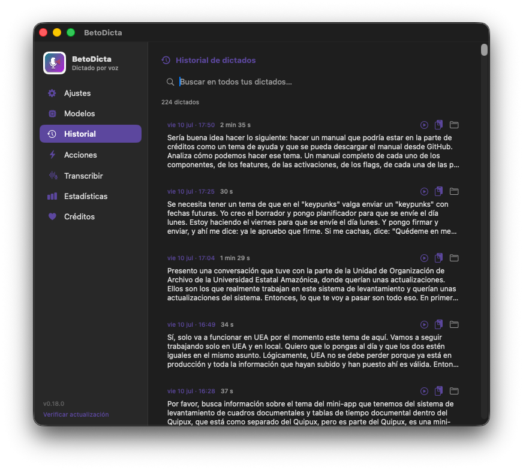

Todos tus dictados, buscables:

- **Buscador** instantáneo — no distingue mayúsculas ni tildes ("aldas" encuentra "Aldás").
- **Buscar por significado (semántica)** 🧠 — enciende el interruptor y busca por IDEA, no por palabra exacta: "bajar el volumen de la música" encuentra dictados sobre "mutear las reproducciones" aunque no compartan palabras. Escribe y pulsa **Enter**; los resultados salen ordenados por **% afín**. Cada dictado se procesa una vez y queda en caché (la primera búsqueda de un historial grande tarda, las siguientes son instantáneas). Se activa y se elige el motor en *Ajustes → Avanzado*: por defecto usa **Interno de BetoDicta** (`bge-m3`, local, gratis y privado); también puedes elegir **Ollama, OpenAI, Gemini, Mistral** o uno personalizado. El selector muestra cuáles están listos (✓) y cuáles requieren descarga o clave (○). Cambiar de motor vuelve a indexar porque los vectores de motores distintos no son compatibles. Apagado, el Historial busca por texto exacto como siempre.
- **▶** escucha el audio original de ese dictado.
- **📋** copia el texto al portapapeles.
- **📁** muestra los archivos en Finder.
- El texto es seleccionable directamente.

## 18. Pestaña Transcribir

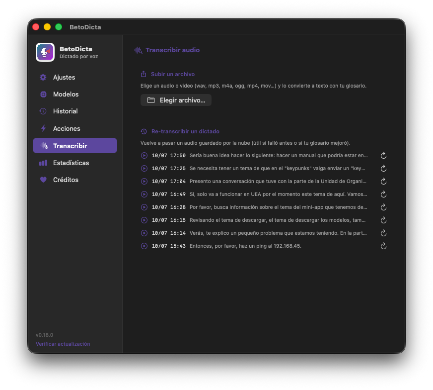

- **Procesar como**: arriba eliges un **modo** (Dictado = solo limpieza, o Correo, Oficio, Tarea, Nota, Traducir, Asistente…). Se aplica tanto al archivo que subes como a la re-transcripción — ágil para, por ejemplo, subir un audio y sacarlo ya como correo o traducido. Buscar no aplica aquí (abre navegador, no da texto).
- **Subir un archivo**: elige un audio o video (wav, mp3, m4a, mp4, mov…) y lo convierte a texto con tu glosario. Ideal para grabaciones de reuniones.
- **Re-transcribir un dictado**: vuelve a pasar un audio del historial por el motor — útil si falló la primera vez o si tu glosario mejoró desde entonces.

## 19. Estadísticas y costo por modelo

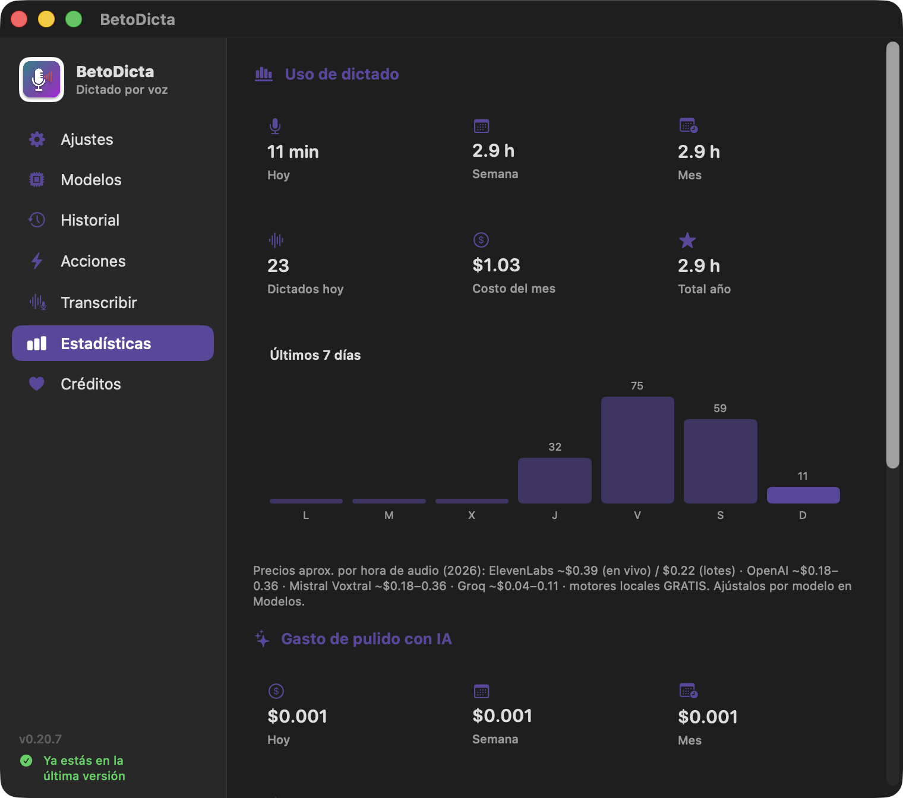

- Minutos dictados hoy / semana / mes / año, número de dictados y **costo estimado del mes**.
- **El costo se calcula por MODELO**, no por proveedor: cada dictado suma según el precio del modelo que realmente se usó (y si el failover cambió de modelo a mitad, cuenta el que entregó). Los motores locales cuestan $0.
- Gráfica de barras de los últimos 7 días.
- **Gasto de pulido con IA**: si usas una IA de pulido de pago, aparece una sección aparte con lo gastado en **pulido** — **hoy / semana / mes**, número de pulidos, **tokens** del día y una gráfica de gasto de los últimos 7 días. Se calcula con el precio (entrada/salida por millón de tokens) del modelo que pule; con modelos locales o `:free` el gasto es $0. Solo se muestra si has pulido con IA este mes.
- El menú de la barra muestra un resumen por proveedor.
- Con **Modo desarrollo** activo aparece la bitácora **Aprendizaje (debug)** (ver [sección 14](#14-que-la-app-aprenda-de-ti-aprendizaje)): las correcciones aprendidas, con 🔊 para las de sonido y ↺ para revertir.

## 20. Actualizar la app

La app **te avisa sola**. Al abrirla revisa en silencio si hay versión nueva y, por defecto, vuelve a comprobar **cada 6 horas mientras permanezca abierta**. Ambas cosas son configurables en *Ajustes → Avanzado*. Si la hay, lo ves en dos lugares:

- **Abajo a la izquierda** del panel de Configuración: botón **"Actualizar a vX"** y un enlace **"Ver novedades"** (para leer los cambios *antes* de actualizar).
- En el **menú de la barra**: un ítem **"⬆︎ Actualización disponible…"** que abre Configuración.

Al pulsar **"Actualizar a vX"** la app descarga el DMG (con **barra de porcentaje**), se reinstala y se reabre sola. Un clic, cero pasos manuales. Al terminar te muestra las **novedades** de la versión. Las copias 0.40–0.42 pueden pasar normalmente a 0.43 porque esta conserva el mismo certificado; desde 0.43, el actualizador exige además la firma Ed25519 del DMG.

Si prefieres no revisar nada a mano, activa **Autoactualizar** (*Ajustes → Avanzado*): cuando encuentre una versión nueva al abrir o en la revisión periódica, la baja e instala sola. Siempre puedes forzar la búsqueda con **"Verificar actualización"** o **"Comprobar de nuevo"** en el pie.

**Estables y beta:** el canal **Automático** (recomendado) sigue versiones beta únicamente cuando la copia instalada ya es beta; una copia estable solo recibe estables. También puedes escoger **Solo estables** o **Estables y beta**. El actualizador consulta la lista de releases como respaldo, porque el endpoint `latest` de GitHub no incluye pre-releases.

- Si no hay nada: "Ya estás en la última versión".
- El historial completo de cambios de cada versión está en **Créditos**.

> **Gobernanza — todo parametrizable**: búsqueda al abrir, canal estable/beta, revisión periódica (1–24 h) y Autoactualizar viven en *Ajustes → Avanzado*. Nada se instala sin tu permiso salvo que actives Autoactualizar.

## 21. Apoya el proyecto

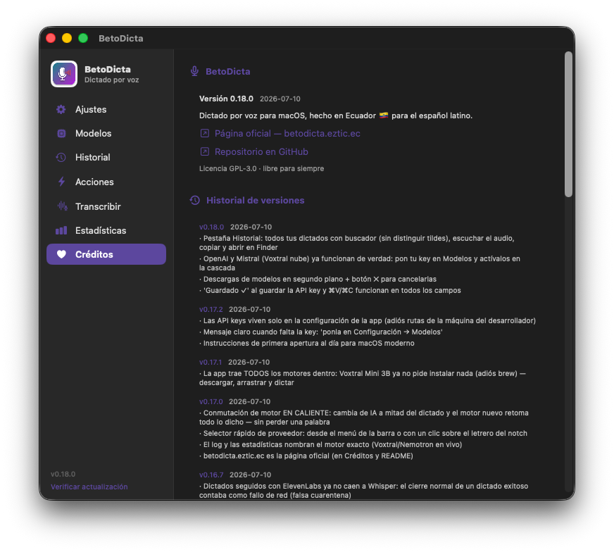

BetoDicta es gratis y libre (GPL-3.0). Si te sirve y quieres que siga creciendo, en **Configuración → Créditos → "Apoya el proyecto ☕"** hay varias formas de aportar:

- **☕ Invítame un café** — tarjeta, Apple Pay o Google Pay ([betodicta.eztic.ec/apoyar](https://betodicta.eztic.ec/apoyar)).
- **💜 GitHub Sponsors** — [github.com/sponsors/btoaldas](https://github.com/sponsors/btoaldas).
- **💳 PayPal**.
- Más formas (transferencia, cripto, etc.) en la página de apoyo.

Cualquier aporte suma — plata, código, difusión o una buena idea en [Issues](https://github.com/btoaldas/BetoDicta/issues/new).

## 22. La caja negra: tus datos

Todo vive en tu Mac, en `~/.betodicta/`:

| Archivo/carpeta | Qué es |
|---|---|
| `historial/año/mes/día/` | Cada dictado: audio (.wav) + texto (.txt). El audio se escribe a disco EN VIVO mientras hablas — un corte de luz no te roba ni un segundo (la app rescata lo grabado al reiniciar) |
| `config.json` | Tus ajustes (incluidas las tarifas por modelo que hayas puesto) |
| `providers.json` | Tu cascada de motores |
| `keyterms.txt` | Tu glosario |
| `reemplazos.json` | Tus reglas de corrección (incluido el marcado 🔊 por sonido) |
| `aprendizajes.jsonl` | La bitácora de lo que la app aprendió de tus correcciones |
| `uso.jsonl` | El odómetro de uso (minutos y modelo por dictado) para las estadísticas |
| `.env` | Tus API keys (solo en tu Mac, permisos `0600`) |
| `ia_personalizadas.json` | Tus gateways propios (URL, key, modelos) — permisos `0600` |
| `models/` | Los modelos de IA descargados |
| `betodicta.log` | El registro de todo (se rota y comprime solo). Las API keys **nunca** se escriben aquí |

**Privacidad**: con motores locales, tu voz **jamás sale de tu Mac**. Con motores de nube, el audio va al proveedor que elegiste (ElevenLabs/Groq/OpenAI/Mistral) bajo sus términos. El pulido y la traducción mandan el TEXTO a la IA que elijas — o **no salen de tu Mac** si usas una IA local (LM Studio / Ollama). El aprendizaje y la coincidencia por audio son 100% locales. Tú controlas qué usas.

**Seguridad**:
- Tus **API keys** y gateways se guardan con permisos `0600` (solo tu usuario) y la carpeta `~/.betodicta` en `0700`. La key **no se envía** si un gateway se configuró con `http://` sin cifrar.
- Las **actualizaciones se verifican por dos barreras**: el DMG completo trae una firma **Ed25519** que BetoDicta comprueba con una clave pública embebida; después exige que el bundle conserve la identidad y el certificado de BetoDicta. Una descarga alterada, sin `.sig` o con otra app se **rechaza**. La clave privada de releases vive solo en el Mac del autor, con permiso `0600`, y nunca se publica.
- El código es **abierto** ([GPL-3.0](https://github.com/btoaldas/BetoDicta)): cualquiera puede auditarlo. Cada release pasa por revisión de código y de seguridad antes de publicarse.

## 23. Solución de problemas

| Síntoma | Causa probable | Solución |
|---|---|---|
| Dicto y sale vacío o "(silencio)" | El micrófono no te capta (¿iPhone cerca? ¿mic equivocado?) | Ajustes → Micrófono → "Integrado del Mac". Verifica que las barras del panel laten al hablar |
| "Escuchando (red caída…)" | Tu internet falló — la app te protege | Dicta normal: transcribe con el motor local al soltar. Vuelve solo cuando la red regrese |
| El letrero salta a otro motor | El #1 falló y el siguiente tomó el mando | Es el diseño. Revisa tu conexión o el orden de la cascada |
| "Falta la API key…" | Ese proveedor de nube no tiene key | Ponla en Configuración → Modelos, o usa los motores locales gratis |
| Un modelo local "no disponible" | No está descargado (o quedó a medias) | Pestaña Modelos → descárgalo (verifica el ✓ de descargado) |
| No pega el texto | Falta el permiso de Accesibilidad | Ajustes del Sistema → Privacidad y seguridad → Accesibilidad → activa BetoDicta |
| La tecla fn no responde | Permiso de Accesibilidad, o fn capturada por el sistema | Revisa Accesibilidad; en Ajustes del Sistema → Teclado pon "Al pulsar la tecla fn: No hacer nada" |
| El micrófono de la barra no aparece o BetoDicta sale repetido | macOS 26 conservó registros de una copia de desarrollo o cruzó la visibilidad con otra app | Actualiza y abre **/Applications/BetoDicta.app**. En Ajustes del Sistema → Barra de menús debe quedar **una sola** fila BetoDicta activada; no uses el interruptor de ChatGPT para mostrarla. Si aún hay duplicados, adjunta una captura al reporte: no hace falta desinstalar tus voces ni borrar `~/.betodicta` |
| **La corrección por sonido no hace nada** | El interruptor global está, pero **ningún término tiene el 🔊** | Editar reemplazos → marca la casilla de la onda 🔊 en el término que quieras (ver [sección 15](#15-corrección-por-sonido-fonética)) |
| **No aprende mis correcciones en la terminal/Claude Code** | Esas apps no exponen su texto por Accesibilidad | Corrige, SELECCIONA el texto y pulsa **⌘⇧L** (ver [sección 14](#14-que-la-app-aprenda-de-ti-aprendizaje)) |

**¿Nada de esto lo arregla?** → **[Reporta el problema aquí](https://github.com/btoaldas/BetoDicta/issues/new)** — cuéntanos qué hiciste, qué esperabas y qué pasó. Si puedes, adjunta las últimas líneas del registro (Configuración → Acciones → Ver registro).

## 24. Preguntas frecuentes

**¿Cuánto cuesta?** La app es gratis y open source (GPL-3.0). Los motores locales son gratis para siempre. Los de nube cobran por hora de audio y **el precio es por modelo** (lo ves y lo editas en Modelos): ElevenLabs `scribe_v2_realtime` ~$0.39 / `scribe_v2` ~$0.22; OpenAI ~$0.18–0.36; Mistral ~$0.18–0.36; Groq ~$0.04–0.11 (con capa gratis).

**¿Funciona sin internet?** Sí — con cualquier motor local (Voxtral, Nemotron, Whisper, Canary). Descárgalos una vez y dicta offline para siempre.

**¿De verdad aprende mis palabras?** Sí. Corrige la palabra ahí donde la pegaste (o selecciónala y pulsa ⌘⇧L en la terminal) y la app guarda la regla sola, 100% local. Ver [sección 14](#14-que-la-app-aprenda-de-ti-aprendizaje).

**¿Puedo dictar en otros idiomas?** BetoDicta está afinada para español latino. Voxtral Realtime detecta el idioma automáticamente; Nemotron soporta 40 idiomas (hoy la app lo fija en español).

**¿Qué tan pesada es?** La app pesa ~32 MB. Los modelos locales van de 74 MB (Whisper Tiny) a 3.2 GB (Voxtral 3B) — tú eliges cuáles descargar. Los modelos cargan en RAM solo al dictar y se descargan solos tras ~2 minutos sin uso.

**¿Dónde pido una función nueva?** En [GitHub Issues](https://github.com/btoaldas/BetoDicta/issues/new) — las ideas son bienvenidas.

---

## 25. Voz propia: biblioteca y entrenamiento

BetoDicta puede hablar con **tu propia voz** (o la de un ser querido), 100 % local. Se abre desde **la barra → Biblioteca de voces**. Hay dos motores de voz, y conviven:

- **XTTS (Calidad)** — conserva mejor la identidad del clon entrenado, pero es pesado y habla **~a tiempo real**.
- **Qwen3‑TTS/MLX (⚖️ Equilibrada)** — clona desde una muestra, corre en Apple Silicon y entrega audio progresivo. Es el puente entre naturalidad y rapidez; no reemplaza el entrenamiento XTTS.
- **Piper/ONNX (⚡ Rápida)** — hornea una voz **fija** que luego habla casi al instante (~5× tiempo real, sin torch). Ideal para respuestas breves; puede sonar más robótica.

XTTS y Piper se entrenan desde una **carpeta de audios** de una sola persona (mientras más voz limpia, mejor; con ~1 a 6 horas rinde muy bien). Qwen3‑MLX no vuelve a entrenar tus siete horas: usa una referencia corta para crear el carril equilibrado. Si ya tienes un XTTS bueno, también puedes usarlo como maestro para ONNX. Nada de tus audios viaja por internet: el runtime vive aislado en tu carpeta personal; solo se descargan las pesas públicas del modelo.

### Crear una versión rápida desde un XTTS que ya suena bien

En la fila de una voz XTTS pulsa **Crear ⚡**. No es una conversión directa del archivo —XTTS y Piper son redes distintas— sino una **destilación local**:

1. BetoDicta crea un corpus español variado y hace que tu XTTS lo lea.
2. Cada audio queda asociado al **texto exacto** que se le pidió: no arrastra anuncios, música, otras voces ni errores de transcripción del dataset original.
3. Piper parte de una base española, carga sus **pesos**, pero inicia optimizadores y calendarios **nuevos**; no hereda el entrenamiento envejecido de la base.
4. Al terminar, BetoDicta mide **inteligibilidad con Whisper** y **parecido de voz**. Solo vincula automáticamente un corte que supere el umbral seguro; si ninguno pasa, conserva XTTS y te manda a la vista avanzada para escuchar/revisar, sin activar una voz dañada.
5. En la biblioteca eliges **Calidad** o **⚡ Rápida** para esa misma persona. Crear ONNX nunca borra XTTS.

El plan es parametrizable: **Prueba** (recorrido corto, no voz final), **Recomendado** (~45–60 min sintéticos), **Alta fidelidad** (~1.5–2 h) o **Máximo** (~3–4 h), y puedes editar las actualizaciones. Antes del primer clip, BetoDicta guarda la cantidad, las etapas y la calidad elegidas. Si amplías el corpus, cierras la app o se apaga la Mac, reutiliza los clips válidos y continúa con **el mismo plan**, sin volver silenciosamente a los valores del selector. Para español empieza con la base **Media**, que es la base nativa española.

### Entrenar una voz Piper (rápida)

1. Biblioteca de voces → **⚡ Entrenar voz Piper (rápida)**.
2. **Preparar el entrenador** (una vez): baja las herramientas y arma el motor de entrenamiento.
3. Elige la **carpeta de audios**, ponle **nombre** y, si quieres, una **persona/prompt** (cómo habla; si lo dejas vacío se genera de los audios).
4. Elige la **calidad** (ver abajo) y, si falta, **descarga su base** (una sola vez).
5. **Entrenar**. BetoDicta:
   - **Fase 1** — transcribe y prepara los audios (Whisper): verás *"X de Y archivos (%)"* y cuántos fragmentos lleva.
   - **Fase 2** — entrena: verás *"paso X de Y (%)"* en vivo, con barra de porcentaje.
6. Guarda **varios checkpoints**. Puedes **escuchar** cualquiera y **usar el que más te guste**. El último no siempre es el mejor: una voz puede ganar parecido y perder claridad al seguir entrenando. BetoDicta compara **10 frases variadas** por corte con Whisper + parecido de voz y recomienda el mejor; tu oído conserva la decisión final. Ese se registra como voz ⚡ en tu biblioteca.

**Corre en segundo plano y es resumible.** Puedes **cerrar la ventana e incluso salir de BetoDicta**: el entrenamiento sigue. Al reabrir, el progreso **vuelve a aparecer solo** y BetoDicta evita lanzar una segunda copia sobre la misma tanda. Si se apagó la computadora, aparece **“Continuar donde quedó”** y detecta si faltaba terminar el dataset, el entrenamiento o la validación. No re-transcribe ni regenera lo que ya estaba bien.

Durante el entrenamiento hay dos niveles de resguardo: los **cortes/hitos** que puedes escuchar y un **checkpoint de seguridad rodante cada 200 pasos**. Al continuar usa el más reciente de los dos, por lo que un apagón pierde como máximo ese pequeño tramo. La validación también guarda sus resultados después de cada checkpoint: si se interrumpe, reutiliza los ya puntuados y reintenta solo los pendientes o los que tuvieron un fallo transitorio.

**Bitácora viva.** Mientras entrena, la app muestra —refrescándose sola cada 2 segundos— la **fase** (1/2), el objetivo real guardado en el plan y en Lightning, **paso global/total**, **época**, **pasos/s**, tiempo transcurrido, **ETA y hora estimada de fin**, además de **CPU, RAM, disco, fragmentos, hitos, checkpoint de seguridad y errores**. Al cerrar y volver a abrir no inventa un 100% con el preset visible: recupera la cantidad y el objetivo exactos con los que arrancó la tanda. La gráfica pequeña es de **avance por tiempo**, no de calidad; la gráfica de calidad aparece al validar los checkpoints. Debajo va el **registro imprimiéndose en vivo** (lo que pasa, bueno o malo). El paso se muestra desde el inicio y distingue correctamente los lotes internos de los pasos globales de Lightning. Todo queda también guardado en `dataset.log` y `piper.log` dentro de la carpeta del proyecto.

**Detener del todo.** El botón **“⏹ Detener del todo”** corta el entrenamiento **de raíz** —mata todos sus procesos (torch, Whisper, ffmpeg)— y te **confirma en pantalla** que no quedó nada corriendo. El control es tuyo; no depende de nada externo.

> Nota de velocidad: en Apple Silicon el entrenamiento usa solo los **núcleos rápidos** (performance). Incluir los lentos (efficiency) dejaba la CPU al 100 % sin avanzar.

### Calidad: media, alta, baja

| Calidad | Qué es | Base |
|---|---|---|
| **Media** (recomendada) | 22 kHz, natural y rápida | **en español** (davefx) |
| **Alta** | Red más grande = más nítida, pero **más lenta al hablar** | en inglés (lessac), se adapta al español |
| **Baja** | 16 kHz, la más veloz y liviana, menor fidelidad | en inglés (lessac) |

Para español, **Media es la mejor opción**: es la única con base nativa en español. **Alta** y **Baja** solo existen con base en inglés; el entrenamiento las **adapta a tu español** (tu audio manda), así que **no se “dañan” ni pasa nada malo** si les envías audio en español — solo necesitan más etapas y hablan un poco más lento. Empieza con **Media**; si quieres, prueba **Alta** y compara escuchando. Nada se pierde: entrenas, escuchas, eliges.

### Requisitos y descargas

- **ffmpeg** (para preparar el audio): si falta, la app avisa — instálalo con `brew install ffmpeg`.
- **Herramientas de Apple** (solo la primera vez, para compilar una pieza): si faltan, la app avisa — `xcode-select --install`.
- Las piezas **pesadas se descargan bajo demanda y con tu permiso** (motor de voz, checkpoint base ~0.8–1 GB por calidad). Nada pesado viaja en la app ni en el repositorio.

> Créditos: Piper (OHF-Voice/rhasspy, GPL-3.0), checkpoints base de `rhasspy/piper-checkpoints`, Coqui XTTS, PyTorch, Whisper, espeak-ng. Ver [CREDITS.md](../CREDITS.md).

---

*BetoDicta — hecho en Ecuador 🇪🇨 por Alberto Aldás en compañía de Claude (Anthropic), programado a pura voz. Licencia GPL-3.0, libre para siempre.*
